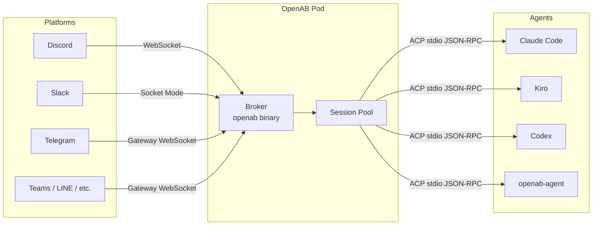

# What is OpenAB?

## The One-Line Answer

OpenAB is a secure, cloud-native **message broker** that connects any chat platform (Discord, Slack, Telegram, Teams…) to any coding agent CLI (Claude Code, Kiro, Codex, Gemini…) using a single open protocol called ACP.

## The Problem It Solves

You have an agent — a CLI that can read code, answer questions, run tools. You want your team to use it through the tools they already have (Discord, Slack). You need:

- **Routing** — messages from users → agent → response back to the right place
- **Sessions** — each conversation thread keeps its own context
- **Security** — credentials never leak, agent runs sandboxed, only allowed users can talk to it
- **Scale** — multiple agents, multiple platforms, multiple bots in the same channel without chaos
- **Operations** — scheduled tasks, lifecycle hooks, secret management, deployment primitives

Building all of that from scratch is a project. OpenAB is that project, done once, open source.

## What OpenAB Is Not

| Not this | Why it matters |
|----------|----------------|
| An orchestration framework | It doesn't chain agents or manage workflows. You do that. |
| A memory system | It doesn't store conversation history beyond the active session. You choose your memory layer. |
| An agent runtime | It doesn't run LLMs. It connects your agent to your chat platform. |
| A prompt injector | It doesn't modify what your agent sees. The pipe is transparent. |

This is deliberate. OpenAB stays thin so you can own the layers above it.

## The Architecture in 30 Seconds

Each agent is a subprocess. Each conversation thread is a session. OpenAB manages the pool and the routing. The agents don't know OpenAB exists.

## Who Uses OpenAB

- **Deployers** — ops engineers who want to put an agent in their team's Discord or Slack
- **Contributors** — engineers extending OpenAB with new adapters, hooks, or agent integrations
- **Agent authors** — CLI developers making their agent ACP-compatible

If you're a deployer, start with [Deploy a Single Agent](./03-use-cases/deploy-single-agent.md).
If you're a contributor, start with [Adapters](./01-core-concepts/adapters.md) and [ACP](./01-core-concepts/acp.md).
