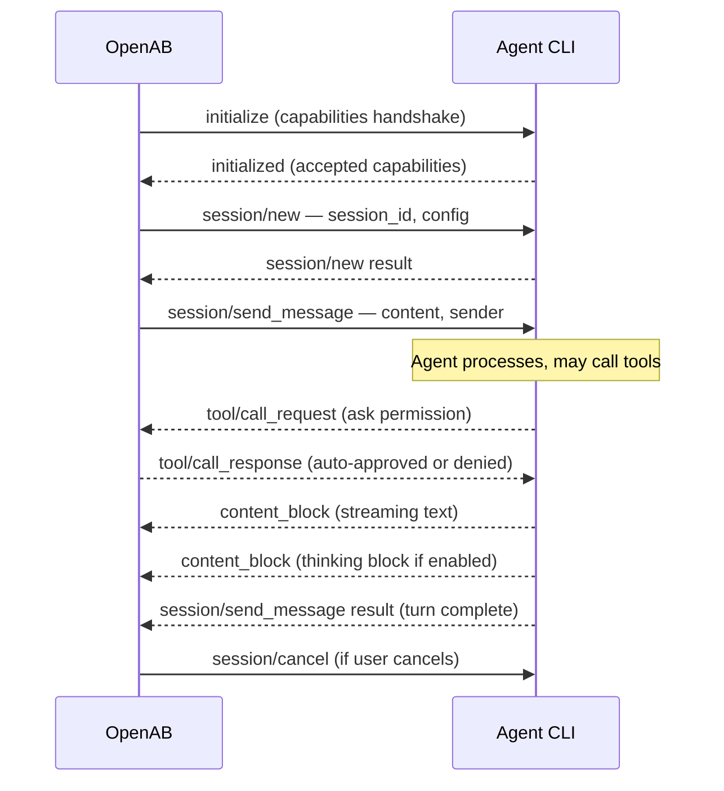

# ACP — Agent Client Protocol

ACP is the contract between OpenAB and agents. If you understand ACP, you understand how any agent plugs in.

## What It Is

ACP is a **JSON-RPC 2.0** protocol. Its classic transport uses stdio pipes: OpenAB spawns an agent subprocess, writes JSON to its stdin, and reads JSON from its stdout.

As of v0.10.0-beta.2, OpenAB speaks ACP in two roles:

- **ACP client** — spawns agent subprocesses and communicates over stdio. This unchanged path remains the main agent integration.
- **ACP server** — accepts external ACP clients at `GET /acp` over WebSocket.

```
OpenAB process
    │
    ├── stdin  ──→  agent subprocess
    └── stdout ←──  agent subprocess
```

For the client role, any CLI that can read from stdin and write to stdout can be an ACP agent. No network ports, OpenAB authentication, or SDK are required on this stdio path.

## Message Flow



## Key Message Types

| Method | Direction | Purpose |
|--------|-----------|---------|
| `initialize` | OAB → Agent | Capability negotiation (tool auto-reply, thinking, edit-streaming) |
| `session/new` | OAB → Agent | Create a new conversation session |
| `session/send_message` | OAB → Agent | Deliver a user message, start a turn |
| `session/cancel` | OAB → Agent | Abort an in-flight turn |
| `session/set_config_option` | OAB → Agent | Change runtime config (model, etc.) |
| `content_block` | Agent → OAB | Streaming text chunk |
| `tool/call_request` | Agent → OAB | Agent wants to run a tool |
| `tool/call_response` | OAB → Agent | OpenAB approves/denies tool call |

## What Agents Don't Know

The agent sees:
- A user message with sender metadata
- Tool call results (auto-replied by OpenAB)
- Session config

The agent does NOT see:
- Which platform the message came from
- OpenAB's config
- Other sessions

This isolation is intentional. Agents stay platform-agnostic.

## Making a CLI ACP-Compatible

The agent needs a subcommand that starts an ACP stdio server:

```bash
kiro-cli acp                    # Kiro
claude-agent-acp                # Claude Code adapter
codex-acp                       # Codex adapter
gemini --acp                    # Gemini
opencode acp                    # OpenCode
openab-agent                    # Native openab agent
```

Then in `config.toml`:

```toml
[agent]
command = "kiro-cli"
args = ["acp", "--trust-all-tools"]
```

That's it. OpenAB spawns the subprocess and speaks ACP to it.

## OpenAB as an ACP Server (v0.10.0-beta.2+)

Both `openab-gateway` and unified `openab run` can expose `GET /acp` for standard ACP clients over WebSocket. Enable the `acp` Cargo feature—already included in `unified`—and set `OPENAB_ACP_ENABLED=true`.

Transport authentication is fail-closed: non-loopback binds must set `OPENAB_ACP_AUTH_KEY`, or OpenAB refuses to mount `/acp`. Phase 1 provides the chat-focused subset: initialization, new sessions, immediate resume acknowledgement without a liveness check or history replay, prompts, text updates, and partial cancellation.

See [Drive Your Agent from an ACP Client](../03-use-cases/drive-agent-from-acp-client.md) for authentication, browser access, supported methods, limits, and known limitations.

## Tool Call Auto-Reply

By default, OpenAB auto-approves all tool calls from the agent. This is what `--trust-all-tools` signals. If an agent requests a sensitive tool call without this flag, OpenAB can be configured to prompt a human (via a slash command) before replying.

## Thinking Blocks

If the agent emits a `thinking` content block (chain-of-thought), OpenAB passes it through to the session but strips it before sending the final message to the chat platform. Users don't see thinking blocks.

## Further Reading

- Source: `crates/openab-core/src/acp/` — protocol types and session lifecycle
- [Sessions](./sessions.md) — how ACP sessions map to conversation threads
- [Which Agent?](../04-decision-trees/which-agent.md) — choosing an agent CLI
- [Drive Your Agent from an ACP Client](../03-use-cases/drive-agent-from-acp-client.md) — WebSocket server setup
- Upstream: `docs/adr/acp-server-websocket-base.md` — Phase 1 ACP server decision
