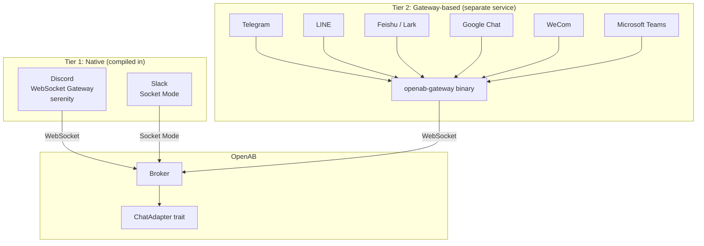

# Adapters — Platform Integration Model

An adapter is the code that translates between a chat platform's API and OpenAB's internal message format. One adapter per platform. OpenAB ships adapters for every major platform.

## Two Tiers



**Tier 1** adapters are compiled directly into the `openab` binary. They use persistent WebSocket connections — no polling, no webhooks exposed.

**Tier 2** adapters run as the `openab-gateway` binary (separate pod or same pod via unified build). Webhook platforms send events to the gateway, which normalizes them and forwards to OpenAB's main broker over an internal WebSocket.

## Not Just Chat: the ACP Endpoint

The gateway and unified binary also expose `GET /acp` when enabled. This is an inbound ACP-server endpoint for IDEs, browsers, and other ACP clients—not a chat adapter or another platform feature.

ACP traffic enters the trust registry as platform `"acp"` with synthetic sender `acp_client`. See [Drive Your Agent from an ACP Client](../03-use-cases/drive-agent-from-acp-client.md) for setup and admission rules.

## The `ChatAdapter` Trait

All adapters implement the same Rust trait (`crates/openab-core/src/adapter.rs`). The trait defines:

- `receive()` — pull the next message from the platform
- `send()` — push a response back to a thread
- `react()` — add/remove emoji reactions
- `create_thread()` — start a new thread from a channel message
- `edit()` — update an already-sent message

Adapter authors implement this trait. OpenAB's `AdapterRouter` dispatches to the right adapter at runtime.

## How Messages Are Normalized

Every incoming message becomes an internal `ChatMessage`:

```
ChatMessage {
    id:         platform-native message ID
    thread_id:  platform-native thread/channel ID
    sender_id:  platform-native user ID
    sender_name: display name
    content:    text (after media processing)
    attachments: [files, images, audio]
    platform:   Discord | Slack | Telegram | ...
}
```

This normalization means the session pool and agent never see platform-specific types.

## Adding a New Platform

1. Implement `ChatAdapter` for your platform in `crates/openab-gateway/src/`
2. Register it in the adapter router
3. Add a Cargo feature flag
4. Add a platform setup doc in `docs/platforms/`

The gateway pattern (Tier 2) is the recommended path for new webhook-based platforms — it keeps the main binary lean and lets you deploy the gateway independently.

## Platform Feature Matrix

| Feature | Discord | Slack | Telegram | LINE | Feishu | Teams |
|---------|---------|-------|----------|------|--------|-------|
| Threads | Native | Native | Simulated | Simulated | Native | Native |
| Reactions | Yes | Yes | No | No | Yes | Limited |
| Slash commands | Yes | No | No | No | No | No |
| Voice/STT | Yes | No | No | No | No | No |
| Edit messages | Yes | Yes | No | No | Yes | Yes |
| File upload | Yes | Yes | Yes | Yes | Yes | Yes |

## Further Reading

- Source: `crates/openab-core/src/adapter.rs` — trait definition and router
- Source: `crates/openab-core/src/discord.rs` — most feature-complete adapter (reference impl)
- [Deployment Topology](../02-mental-models/deployment-topology.md) — where adapters run
- [Which Adapter?](../04-decision-trees/which-adapter.md) — native vs gateway trade-offs
