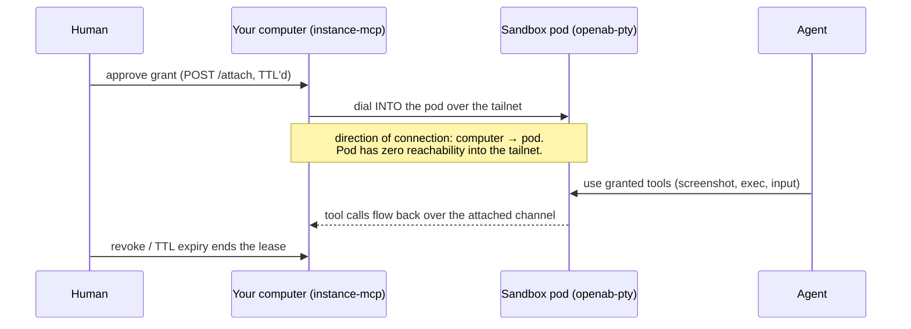

# Sandboxes & Computer Grants — The Agent Calls a Computer

> **Status:** This concept spans the openab *ecosystem*, not just `openabdev/openab` itself.
> Shipped code lives in two sibling repos: [`openabdev/openab-pty`](https://github.com/openabdev/openab-pty)
> (the sandbox runtime) and [`openabdev/instance-mcp`](https://github.com/openabdev/instance-mcp)
> (the computer-side executor, at 0.8.0). The Sandbox Adapter ADR is **Proposed**; the
> end-to-end "cloud brain + thin executor" design (openab#1544) is an **open design issue**.
> Maturity labels are inline below — don't treat everything here as released openab behavior.

## The Thesis

> **A computer is something the agent *calls*, not somewhere the agent *lives*.**

The convergent pattern across the industry (bot VMs, vendor-hosted agent desktops) is to
give the agent a whole machine to inhabit. OpenAB's direction inverts it:

- The **agent runtime stays tiny** — a thin, long-lived brain (on the order of
  0.25 vCPU / 512 MB) that holds the conversation, credentials policy, and routing.
- **Toolchains run in disposable sandboxes** the agent dials into on demand. A compromised
  task burns a throwaway container, not the brain and not your laptop.
- **Your actual computer is a *grant*** — an explicit, revocable, TTL'd lease a human
  hands to the agent, not a standing residence.

This is the same separation the [trust model](./trust-model.md) applies to identity,
extended to compute: blast radius is bounded by construction, not by hope.

## Piece 1 — Sandbox Runtime (`openab-pty`) *(shipped, sibling repo)*

`openab-pty` hands out shell sessions inside locked-down containers, reached over a
WireGuard tailnet. It ships an `oab-toolchain` sandbox image so the heavyweight dev
toolchain lives in the disposable layer, not in the agent image.

**Egress honesty** *(docs tightened in instance-mcp#50)*: the guarantee is **no
*tailnet* egress** — the sandbox cannot reach other machines on your tailnet.
**Internet egress is open by default.** Don't read "sandboxed" as "airgapped."

## Piece 2 — Sandbox Adapter ADR *(Proposed)*

The Sandbox Adapter ADR (instance-mcp, `docs/adr/sandbox-adapter.md`) proposes a
`sandbox_*` MCP tool family — `sandbox_create` / `sandbox_exec` / `sandbox_poll` /
`sandbox_terminate` — over pluggable backends:

| Backend | Where it runs | Why you'd pick it |
|---|---|---|
| **OrbStack** | your own Mac (e.g. a Mac mini) | Phase 1; zero cloud spend, hardware you own |
| **k3s** | Pi / mini-PC cluster | cheap always-on fleet |
| **Lambda MicroVMs** | your AWS account (Firecracker) | per-second billing, scale-to-zero |

Same tool surface regardless of backend — the agent doesn't know or care where the
sandbox materializes. Until the ADR lands, treat the table as direction, not contract.

## Piece 3 — Reverse Attach *(shipped in instance-mcp; verified on real hardware)*

The security inversion that makes "borrow my computer" tolerable:

**The sandbox never connects out to your machines. Your computer dials *into* the pod.**

Because the pod can't initiate connections into your tailnet, compromising the agent or
its sandbox doesn't yield a path to your machines — there is nothing to pivot through.
Verified end-to-end on real hardware (Mac mini → tailnet → pod, ~20 ms attach latency).
Grants survive an executor daemon restart (instance-mcp#43), and **switchboard mode**
(0.8.0) lets the executor dial a broker's `/vm/attach` instead of a specific pod.

**What a grant lends is governed by tool profiles** — every tool is classified, boundary
tests fail on unclassified ones, and the `desktop` profile is documented as
shell-equivalent (if it can type, it can do anything your shell can). There is also an
`observe`-only profile, with an explicit prompt-injection caution: what the agent *sees*
on your screen is untrusted input.

## Piece 4 — Any Computer as Hands *(shipped in instance-mcp)*

The executor started Mac-only; the `mac` naming has been unified to **`computer`**
(update old configs). A Rust port with **one core and per-OS backends** now covers:

- **macOS** — signed universal app + installer; screenshots, mouse/keyboard, osascript,
  and Playwright re-served as `browser_*` tools under the tool profile.
- **Linux / Raspberry Pi / headless Ubuntu server** — a headless "seat"; on a Pi,
  screenshots in ~1 s and ~20 ms exec round-trips; Chromium browsing works.
- **Windows** — future per-OS backend, not started.

Any machine you own can be lent to the agent as hands for an hour — same grant, same
profiles, same reverse-attach direction.

## Piece 5 — The Closed Loop *(open design, openab#1544)*

The end state under design: the agent brain runs in the cloud (k8s), does its heavy work
in disposable sandboxes, and — when a task genuinely needs *your* machine — requests a
grant; you approve it and watch every action live in OpenAB Connect while the lease runs.
That full loop is an open design issue, not shipped openab behavior.

## Why This Shape (and not the alternatives)

| Alternative | Why not |
|---|---|
| Agent lives on your laptop | Standing access; a bad task has your whole machine, forever. |
| Vendor-hosted agent desktop, closed source, auto-updating edge client | The auto-update channel is a permanent third-party code-execution path into your network, and all traffic transits the vendor. |
| OpenAB shape | Open source (read every line before you run it), self-hosted, disposable sandboxes, and human-granted TTL'd leases for real hardware. |

**Related:** [Trust Model](./trust-model.md) · [Adapters](./adapters.md) ·
[Control Plane](./control-plane.md) · [MCP Facade](./mcp-facade.md)
