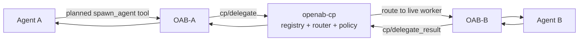

# Agent Control Plane — Direct Agent-to-Agent Delegation

> **Status:** ADR accepted; PR 1/4 shipped the standalone `openab-cp` binary—registry, router, and policy. Broker integration, agent-facing tools, and CLI land in PRs 2–4. **Unreleased — on `main` after v0.10.0-beta.3.**

The symmetry is simple: **the gateway routes human↔agent messages; the control plane routes agent↔agent messages.**

The Agent Control Plane is a standalone hub-and-spoke service for direct delegation between OpenAB runtimes. It uses a private WebSocket protocol instead of sending orchestration traffic through a chat platform.

## Why a Separate Path

Chat-based bot-to-bot remains the right mechanism when humans should see and participate in the collaboration. It is a poor transport for machine delegation:

| Chat-platform b2b pain | Control-plane answer |
|------------------------|----------------------|
| Discord rate limits around 5 messages/second | Structured direct routing over WebSocket |
| Per-hop platform latency | Low-latency runtime-to-runtime path |
| 2,000-character formatting constraints | Prompts and results up to configured byte caps |
| Orchestration noise in human channels | Private delegation traffic |

The control plane complements chat collaboration; it does not replace it.

## Architecture

## Three Responsibilities

| Part | Responsibility |
|------|----------------|
| **Registry** | Runtimes register outbound with namespace, name, type (`primary` or `worker`), labels, and `max_delegated_sessions`. Heartbeats run every 15 seconds; leases expire after 45 seconds. |
| **Router** | Resolves a target by name or labels to a live, non-saturated instance, forwards the delegation, and routes the result back. |
| **Policy** | Enforces namespace policy centrally. By default only primaries may initiate, maximum depth is 1, worker→worker is denied, cycles are rejected, and cross-namespace delegation is denied. |

Registry state is intentionally ephemeral. A control-plane restart rebuilds it as runtimes reconnect and re-register.

## Wire Contract

Frames are JSON-RPC-style messages over WebSocket:

| Method | Purpose |
|--------|---------|
| `cp/register` | Must be the first frame; registers the runtime identity and capacity, and returns heartbeat/lease timing. |
| `cp/heartbeat` | Keeps the registration alive at the returned interval; missing heartbeats beyond `lease_expiry_secs` deregister the runtime. |
| `cp/delegate` | Sends a prompt to a target selected by name or labels. |
| `cp/delegate_result` | Returns the delegated task result to its caller. |
| `cp/cancel` | Cancels an admitted delegation. |

The caller creates `delegation_id`, which is the idempotency key. A delegation may include parent references and an absolute `deadline`. If a child deadline exceeds the parent's remaining budget, policy rejects the delegation with `DeadlineExceedsParent`; the server does not clamp it.

After admission, the control plane adds facts clients cannot self-assert:

- **`admission` token** — unique and never reused; required for results, cancellation, and parented delegation.
- **Authenticated `from`** — derived from the credential-bound identity.
- **Full `chain`** — delegation ancestry used for depth and cycle checks.

## Important `cp.toml` Settings

| Setting | Default / behavior |
|---------|--------------------|
| `listen` | `127.0.0.1:9800` |
| `allow_insecure_bind` | Required for non-loopback; use only behind a TLS proxy or on a private network. |
| `max_deadline_secs` | 1800 seconds |
| `max_result_bytes` | 256 KiB; oversized results are truncated keeping the head. |
| `max_frame_bytes` | 1 MiB |
| `max_prompt_bytes` | 256 KiB |
| `max_connections_per_identity` | 8 |
| `max_inflight_delegations` | 4096 |
| `default_max_delegated_sessions_cap` | 16 |
| `[[agents]]` | Immutable identity table: key, namespace, name, and type. |
| `[namespaces.<ns>]` | Policy overrides such as `max_depth` and `allow_worker_initiation`. |

## Authentication and Admission

Clients send `Authorization: Bearer <key>` during the WebSocket upgrade. The key maps server-side to an immutable `[[agents]]` identity. Registration claims must match that binding; a mismatch fails with `IDENTITY_MISMATCH`.

Loopback is the safe default. PR 1/4 already includes control-plane-generated registration handles, atomic admission, non-reusable admission tokens, and per-identity quotas.

## Shipped vs. Coming

**Shipped in PR 1/4:** the standalone `openab-cp` binary and its protocol, config, server, registry, router, and policy implementation.

**Not shipped yet (PRs 2–4):**

- OAB-side `[control_plane]` client configuration and runtime connection
- Agent-facing `spawn_agent`, `check_delegation`, `list_agents`, and `cancel_delegation` tools
- The Unix-domain-socket, per-session tool injection path; `OPENAB_CP_KEY` must never enter the agent environment
- Control-plane CLI workflows

The planned agent tools follow the [MCP Facade](./mcp-facade.md) pattern but are a separate tool set injected through ACP `session/new` `mcpServers`.

## Non-Goals in v1

- No DAG or pipeline engine; orchestration stays in the primary agent's reasoning.
- No durable inbox or offline delivery; both runtimes must be online.
- No session-management primitives yet.
- Worker→worker delegation is protocol-ready but denied by default policy.
- No persistent control-plane state.

This is not a chat adapter and does not replace OpenAB sessions. Adapters remain the human-visible ingress; each receiving runtime still executes delegated work through its own agent/session machinery.

## Further Reading

- Upstream: `docs/adr/agent-control-plane.md`
- [Multi-Agent](../02-mental-models/multi-agent.md) — visible collaboration versus direct delegation
- [OAB MCP Facade](./mcp-facade.md) — the pattern planned for agent-facing delegation tools
