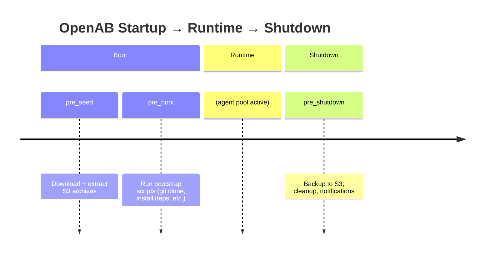

# Hooks — Lifecycle Scripts

Hooks are shell scripts that OpenAB runs at specific points in its own lifecycle. They're how you bootstrap the environment before an agent starts and how you clean up after it stops.

## The Three Hooks



### `pre_seed`

Runs before anything else. Its job is to lay down archive layers from S3.

```toml
[hooks.pre_seed]
inline = '''#!/bin/sh
aws s3 cp s3://my-bucket/workspace.tar.gz /tmp/workspace.tar.gz
tar -xzf /tmp/workspace.tar.gz -C ~/
'''
```

Use case: shipping a pre-built workspace (cloned repos, installed toolchains, dot-files) as an S3 archive. Much faster than running `git clone` at boot.

### `pre_boot`

Runs after pre_seed, before the agent pool starts. Most common hook.

```toml
[hooks.pre_boot]
inline = '''#!/bin/sh
git clone https://github.com/myorg/myrepo ~/myrepo
cd ~/myrepo && npm install
'''
```

```toml
[hooks.pre_boot]
path = "/scripts/bootstrap.sh"   # absolute path on the container
```

```toml
[hooks.pre_boot]
url = "https://gist.github.com/.../bootstrap.sh"
sha256 = "e3b0c44298fc1c149afbf4c8996fb92427ae41e4..."  # required for remote
```

### `pre_shutdown`

Runs after the agent pool is drained, before the process exits.

```toml
[hooks.pre_shutdown]
inline = '''#!/bin/sh
tar -czf /tmp/workspace.tar.gz ~/myrepo
aws s3 cp /tmp/workspace.tar.gz s3://my-bucket/workspace.tar.gz
'''
```

Use case: back up the agent's working directory so the next boot restores where it left off (pre_seed + pre_shutdown as a persistence loop).

## Execution Environment

Hooks run in a **sanitized environment** — the same principle as the agent subprocesses:

**Available env vars:**
- `HOME`
- `PATH`
- `USER` (Unix) / `USERNAME`, `USERPROFILE`, `APPDATA`, `LOCALAPPDATA`, `TEMP` (Windows)
- Cloud credential env vars (AWS, GCP, Azure) if configured

**Not available:**
- Bot tokens
- Agent API keys
- Any other secrets from config

Secrets resolved via `aws-sm://` or `exec://` references in config are NOT passed to hook environments. If your hook needs AWS access, it uses the pod's IAM role directly.

## Security Rules

| Rule | Why |
|------|-----|
| `path` must be absolute | Prevents relative path confusion |
| `url` requires `sha256` | Prevents TOCTOU attacks on remote scripts |
| Temp files created with `0700` permissions | No world-readable hook scripts |
| Only runs once per lifecycle phase | No retry loops |

## Failure Behavior

If a hook exits with a non-zero code:
- `pre_seed` failure → OpenAB exits (can't proceed without workspace)
- `pre_boot` failure → OpenAB exits (agent pool won't start in broken environment)
- `pre_shutdown` failure → logged as error, process exits anyway (shutdown always completes)

## Further Reading

- Source: `crates/openab-core/src/hooks.rs`
- Source: `crates/openab-core/src/pre_seed.rs` — S3 archive handling
- Docs: `docs/hooks.md` — full hook reference
- [Use Case: Hook into Lifecycle](../03-use-cases/hook-into-lifecycle.md)
