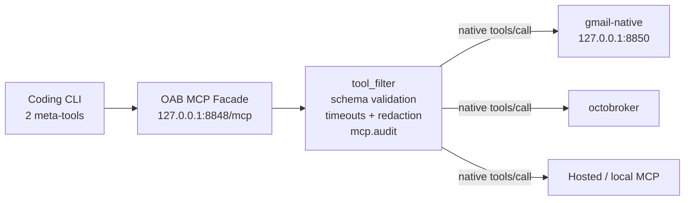

# OAB MCP Facade — Two Tools to Rule Them All

> **Version gate:** Unreleased — on `main` after v0.10.0-beta.2.

The OAB MCP Facade is a loopback Streamable HTTP MCP server that turns all of an agent's configured capabilities into two agent-facing tools:

| Tool | Purpose |
|------|---------|
| `search_capabilities` | Optionally takes a `query` and returns authorized tools with name, description, input schema, provider, and availability. |
| `execute_capability` | Takes a tool `name` and `arguments`, validates the arguments against JSON Schema, then dispatches the call. |

Instead of loading a flat list of every provider tool, any MCP-capable coding CLI—Kiro, Claude Code, Codex, or another client—connects to `http://127.0.0.1:8848/mcp` and progressively discovers only what it needs.

## Architecture



Downstream calls remain native `tools/call` requests. That matters when a provider such as octobroker applies policy by real tool name rather than by the facade's `execute_capability` wrapper.

## Enable It

The presence of `[mcp]` in `config.toml` starts the listener; without that table, nothing listens:

```toml
[mcp]
listen = "127.0.0.1:8848"
```

A non-loopback address is refused at startup. The `[mcp]` table contains listener settings only. Provider connections belong in layered configuration:

- `~/.openab/agent/mcp.json` — global providers
- `./.openab/agent/mcp.json` — project providers

Per-provider `tool_filter` include/exclude rules make excluded tools invisible to discovery and reject them at execution. For downstream servers configured in `mcp.json`, the facade also validates arguments, enforces timeouts, redacts secrets, and emits an audit log. In-process session-bound sources such as browser control instead receive facade argument validation and audit logging, plus the separate `[mcp] tunnel_timeout_seconds`; the full downstream policy path does not apply.

An adapter-less config containing only `[mcp]` is valid. `openab run -c facade-only.toml` can therefore serve the facade on coding-CLI-only hosts, in development loops, or on CI runners. The former `openab-agent mcp-facade` subcommand no longer exists.

## Session-Aware Sources

For each chat session, the broker mints one opaque bearer and injects it into the agent subprocess as `OPENAB_SESSION_TOKEN`; it is never written to a file. The facade resolves `Authorization: Bearer ...` back to that session, allowing sources such as browser control to expose tools only to the matching agent session.

OpenAB writes one static helper file at `<workdir>/.openab/mcp-facade.json`:

```json
{"mcpServers":{"openab":{"url":"http://127.0.0.1:8848/mcp","headers":{"Authorization":"Bearer ${OPENAB_SESSION_TOKEN}"}}}}
```

It does **not** edit a coding CLI's MCP configuration. Registration is an operator step:

- **Claude Code:** `claude mcp add --transport http oab http://127.0.0.1:8848/mcp`. This registers the endpoint **without** the `Authorization: Bearer ${OPENAB_SESSION_TOKEN}` header, so session-bound sources such as browser control remain invisible. Broker-spawned agents should instead use the generated `<workdir>/.openab/mcp-facade.json`, for example through `--mcp-config`.
- **Kiro:** when using `--agent <name>`, register the server in `~/.kiro/agents/<name>.json`; global settings are not used for that named agent.

## Trust Boundary

The facade is loopback-only and deliberately has no general authentication layer: the host or pod boundary is its trust boundary. Any process on that host can invoke every capability that does not require a session. Session-bound sources are filtered out unless a request carries the matching per-session bearer.

Do not enable the facade on a host that colocates untrusted processes.

> **Audit gotcha:** Audit records use the bare tracing target `mcp.audit`. `RUST_LOG=openab=debug` does not match it, so auditing is silently off. Name it explicitly, for example `RUST_LOG=openab=debug,mcp.audit=info`, or use a filter that raises the global default.

## Facade vs. octobroker

The facade and octobroker solve different scopes:

- **Facade:** pod-level discovery for one agent's capabilities, personal OAuth credentials, and a host trust boundary.
- **octobroker:** fleet-level identity, default-deny policy, and centrally minted short-lived organization credentials.

They compose: an octobroker endpoint can be one of the facade's downstream providers in `mcp.json`.

CLI naming follows the subsystem pattern `openab mcp <addon> <action>`. Top-level verbs act on the bot; production serving is config-driven, while namespace `serve` commands are development-only.

## Further Reading

- Upstream: `docs/oab-mcp-facade.md`
- Upstream: `docs/adr/oab-mcp-adapter.md`
- Upstream: `docs/gmail-native.md`
- [Trust Model](./trust-model.md) — the host and session trust boundaries
- [Let Your Agent Drive the Browser](../03-use-cases/browser-control-from-chat.md) — a session-aware capability source
