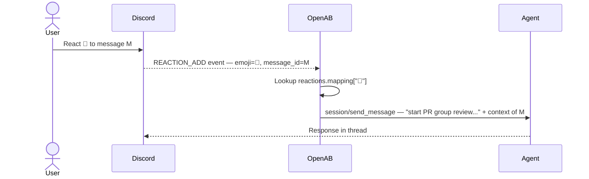

# Reactions Mapping — Emoji as Agent Control Panel

OpenAB can map emoji reactions to agent prompt strings. When a user reacts to a message with a mapped emoji, the agent receives the corresponding instruction as if the user typed it — turning any message into a one-tap command.

## Configuration

```toml
[reactions.mapping]
"👍" = "OK"
"🔄" = "start PR group review. Ask them to feedback to you with explicit mentions and reply_to."
"📝" = "post final aggregated comment and hide previous outdated ones"
"5️⃣" = "explain to me using 5-ask framework"
"🖥️" = "monitor it every 10-30 seconds until state changes"
"🔨" = "Fix and push"
"🏗️" = "Fix and push and start group review. Ask them to feedback to you with explicit mentions and reply_to."
```

When a user adds the `🔄` reaction to a message, the agent receives:

> "start PR group review. Ask them to feedback to you with explicit mentions and reply_to."

The reacted message is included as context — the agent knows which message was reacted to.

## How It Works



OpenAB handles the event, looks up the mapping, and injects the prompt into the session for that thread. The agent sees the mapped string as a regular user message — no special handling needed in the agent.

## The PR Control Panel Pattern

A practical way to manage the PR review lifecycle from Discord without typing commands:

| Emoji | Maps to | When to use |
|-------|---------|------------|
| `🔄` | Start PR group review | Kick off a fresh review cycle |
| `📝` | Post final aggregated comment | After all reviewers have responded — consolidate into one comment |
| `5️⃣` | Explain using 5-ask framework | Quickly evaluate any PR or proposal |
| `🖥️` | Monitor every 10-30s until state changes | Watch a deploy, CI run, or long-running operation |
| `🔨` | Fix and push | Apply a straightforward fix |
| `🏗️` | Fix, push, and restart group review | Fix + re-trigger the full review loop |
| `👍` | OK | Acknowledge / confirm |

## Key Design Properties

**Zero typing required.** One emoji tap on any message triggers a full agent workflow. Works from mobile.

**Context-aware.** The agent knows which message was reacted to — it can read the PR diff, comment, or status message the user reacted to and act on that specific content.

**Composable with b2b.** When a reviewer reacts `🔄` on a draft, the agent starts a group review — mentioning other bots and requesting explicit `reply_to` threading. The result is a structured multi-agent review initiated by a single tap.

**Works with the 5-Ask Framework.** React `5️⃣` to any PR description or proposal and the agent immediately produces a structured evaluation. See [The 5-Ask Framework](../03-use-cases/contributing-pr-lifecycle.md#the-5-ask-framework).

## Platform Support

Reactions mapping requires platform support for reaction events:

| Platform | Reaction events | Notes |
|----------|----------------|-------|
| Discord | Yes | Full support — `REACTION_ADD` events |
| Slack | Yes | `reaction_added` events |
| Feishu | Yes | Via gateway |
| Telegram | Partial | Limited emoji set |
| LINE / Teams / Google Chat | No | No reaction event support |

## Further Reading

- [Directives](./directives.md) — the other channel agents use to communicate with OpenAB
- [Multi-Agent](../02-mental-models/multi-agent.md) — how `reply_to` and group review work
- [PR Lifecycle](../03-use-cases/contributing-pr-lifecycle.md) — where this control panel is used in practice
