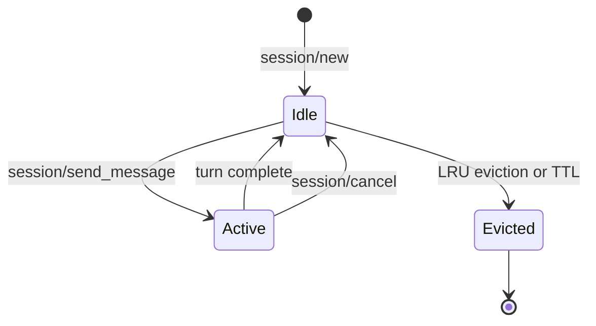

# Sessions — Conversation Lifecycle

A session is a live ACP subprocess paired with a conversation thread. Understanding sessions is the key to understanding how OpenAB manages state and scale.

## Session = Thread = Subprocess

```
Discord Thread #42
    └── Session { id: "sess-abc123" }
            └── ACP subprocess: kiro-cli acp (PID 8821)
                    └── Working directory: ~/.openab/sessions/sess-abc123/
```

One thread → one session → one agent subprocess. Always.

When a new message arrives in thread #42, OpenAB looks up its session, writes the message to that subprocess's stdin, and streams the response back. There is no shared state between threads.

## Session Pool

OpenAB maintains a **session pool** with configurable limits:

```toml
[agent]
max_sessions = 10          # hard cap on concurrent sessions
session_idle_ttl = "24h"   # evict after this much silence
```

When the pool is full and a new thread needs a session, the **least-recently-used** session is evicted (process killed, resources cleaned up). If eviction isn't possible (all sessions active), the new message is queued.



## Session Creation

A session is created on the **first message to a thread** that matches the channel allowlist. The flow:

1. Message arrives in allowed channel
2. No session exists for this thread → pool creates one
3. OpenAB spawns: `kiro-cli acp` (or configured command)
4. ACP `initialize` handshake
5. ACP `session/new` with session config
6. Message delivered via `session/send_message`

Subsequent messages to the same thread skip steps 2-5.

## Session Destruction

Sessions are destroyed when:
- `session_idle_ttl` expires (no messages for that duration)
- Pool is full and this is the LRU session
- User runs `/reset` slash command (Discord)
- OpenAB shuts down (graceful drain)

On destruction, the subprocess receives SIGTERM. OpenAB waits for graceful exit before cleanup.

## Working Directories

Per-thread working directories are opt-in:

```toml
[agent]
per_thread_workdir = true
```

When enabled, each session gets `~/.openab/sessions/{session_id}/` as its working directory. The agent's file operations are scoped to that directory unless it explicitly changes path.

Users can also set a custom working directory at session creation via a control directive:

```
@Bot [[ws:~/myproject]] help me refactor this
```

This sets the session's working directory to `~/myproject` (validated: must exist, within home, no path traversal).

## What Agents Know About Sessions

The agent receives session metadata at `session/new`:

```json
{
  "session_id": "sess-abc123",
  "config": {
    "model": "claude-opus-4-7",
    "temperature": 0.7
  }
}
```

The agent does NOT receive: thread ID, channel ID, platform name, other session IDs.

## Session Config at Runtime

Config options can change mid-session without restarting the subprocess:

```json
{ "method": "session/set_config_option", "params": { "model": "claude-haiku-4-5" } }
```

This is what Discord's `/models` slash command uses — it sends a `set_config_option` to the live session.

## Further Reading

- Source: `crates/openab-core/src/dispatch.rs` — session pool and routing
- Source: `crates/openab-core/src/acp/` — session protocol types
- [Data Flow](../02-mental-models/data-flow.md) — full message journey
- [Session Lifecycle Diagram](../02-mental-models/session-lifecycle.md)
