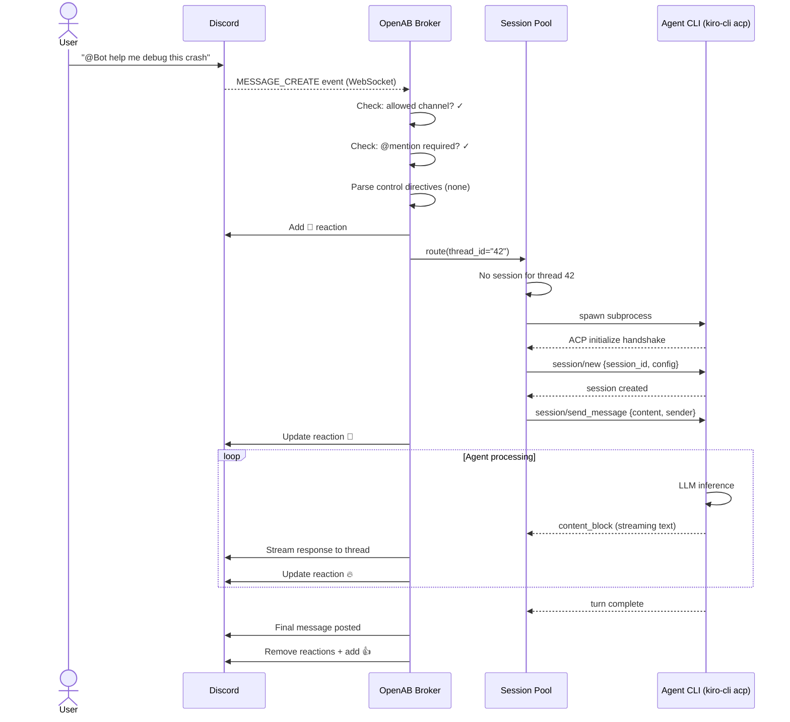
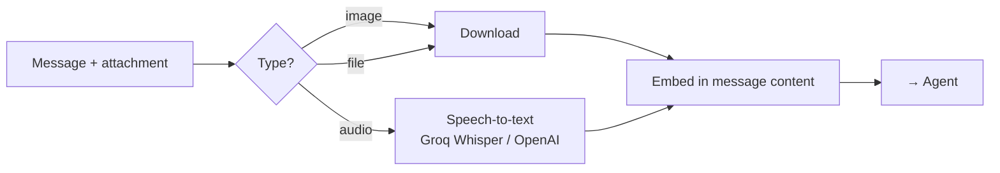
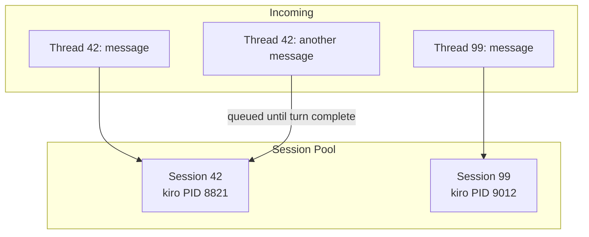

# Data Flow — Message End to End

The full journey of a message, from a user typing in Discord to the agent's response appearing in the thread.

## Happy Path

## What Gets Stripped

Before the response reaches Discord, OpenAB strips:

1. **Output directives** — `[[reply_to:ID]]`, etc. (never shown to user)
2. **Thinking blocks** — chain-of-thought content from agent's reasoning
3. **Tool call details** — agent tool requests/responses (internal)

What the user sees is only the text content the agent intended for them.

## Media Processing

If the message contains attachments (images, files, audio):

Audio messages (Discord voice messages, Telegram voice notes) are transcribed before the agent sees them. The agent receives text — it never sees raw audio.

## Concurrent Thread Handling

OpenAB handles multiple threads concurrently without queuing:

Within a single thread, messages are serialized — the second message waits for the first turn to complete. Across threads, everything is concurrent (up to the pool's max sessions).

## Error Paths

| Error | What happens |
|-------|-------------|
| Agent subprocess crashes | Session evicted, error message sent to thread |
| Platform WebSocket drops | Adapter reconnects with backoff |
| ACP turn timeout | Session cancelled, error message sent |
| Pool full + all sessions active | Message queued (configurable timeout, then dropped) |
| Secret resolution fails at boot | Process exits — never starts in broken state |
