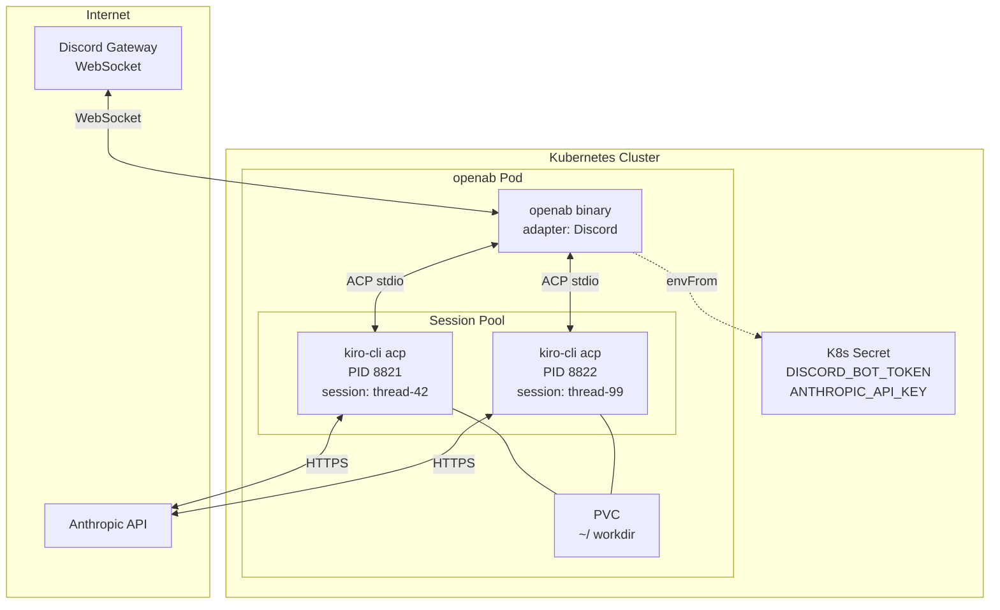
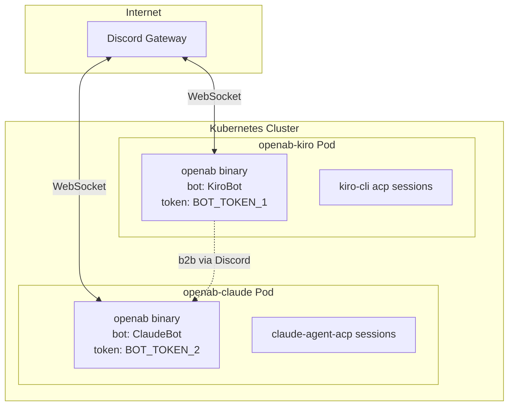
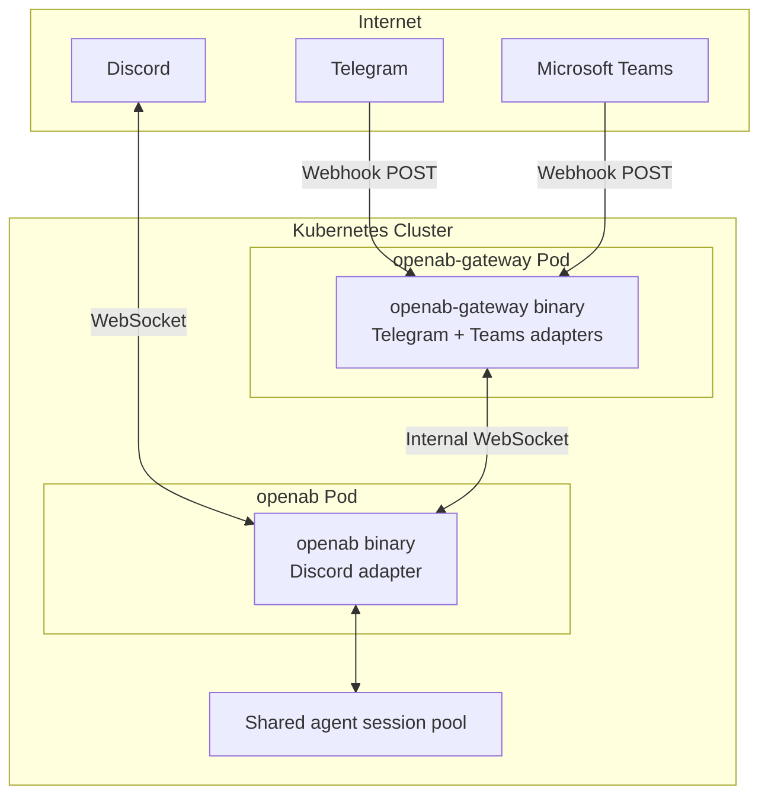
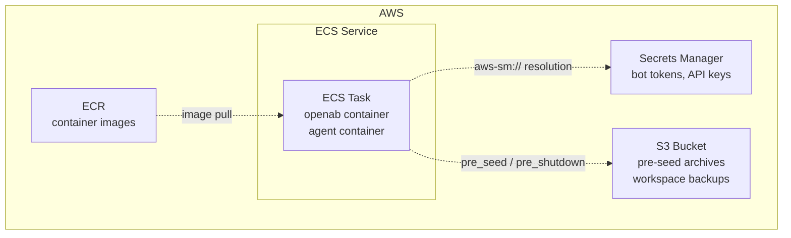
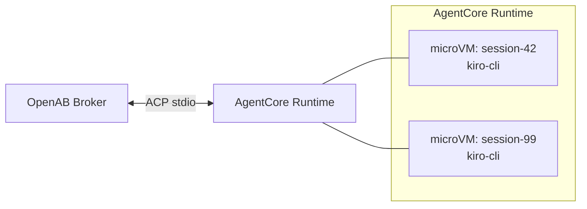

# Deployment Topology

How OpenAB actually runs in production: what pods exist, what talks to what, and where things live.

## Minimal: Single Agent, Discord



One pod. One ACP subprocess per active thread. PVC for working directory persistence.

## Multi-Agent: Two Bots, One Channel



Each bot is an independent pod with its own token, session pool, and ACP subprocess fleet. They coordinate via the platform itself (Discord messages) — not via any shared internal channel.

## With Gateway (Webhook Platforms)



The gateway normalizes webhook events and forwards them to the main broker as if they came from a native adapter. From the session pool's perspective, all platforms look the same.

## AWS ECS Fargate



On ECS, secrets come from Secrets Manager via the `aws-sm://` syntax. Workspace persistence uses S3 (pre_seed hook downloads, pre_shutdown hook uploads).

## AWS AgentCore

AgentCore runs each agent session in its own **microVM** (Firecracker-based), providing hardware-level isolation. OpenAB runs as the broker outside the microVMs; the ACP interface is unchanged.



## ACP Client Endpoint (v0.10.0-beta.2+)

```mermaid
flowchart LR
    C[Zed / Browser] -->|WS(S) /acp| O[openab Pod]
    K["Non-loopback: bearer key required<br/>Localhost: keyless allowed"] -.-> O
```

Standard ACP clients can drive the pod directly through its WebSocket endpoint. Set `OPENAB_ACP_AUTH_KEY` on non-loopback binds; keyless access is allowed only on localhost.

## Local Development

```bash
openab run -c config.toml
```

Runs entirely on localhost. No containers, no K8s. Not suitable for production (no sandboxing).

## Further Reading

- Helm chart: `charts/openab/values.yaml`
- ECS: `operator/` — oabctl CLI for ECS control plane
- [Hooks](../01-core-concepts/hooks.md) — pre_seed / pre_shutdown for S3 persistence
