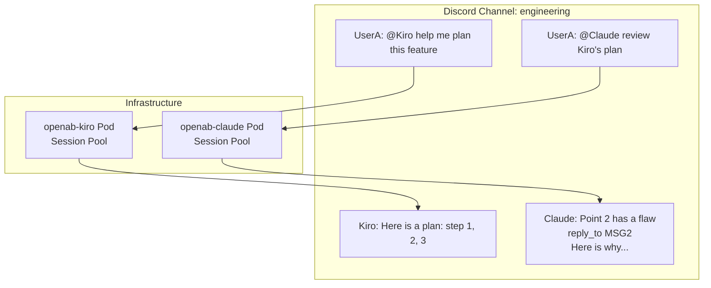
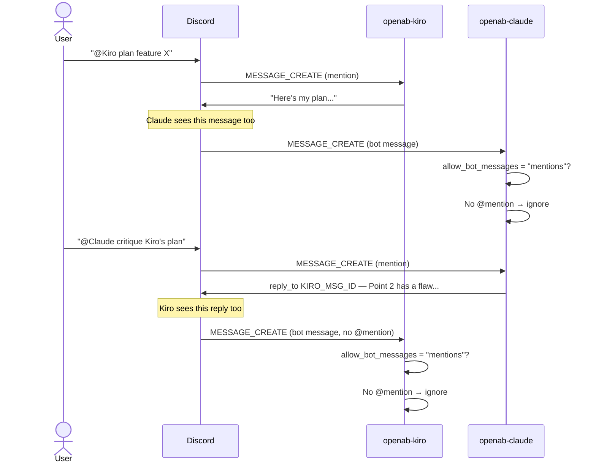
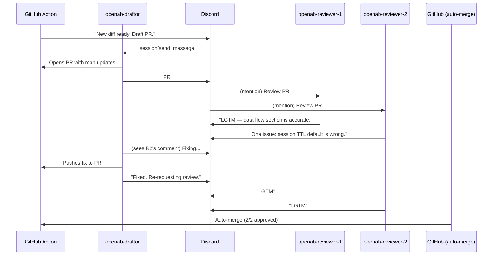

# Multi-Agent — How Bots Collaborate

OpenAB is designed for multi-bot channels from day one. Each bot is a fully independent pod. Coordination happens through the platform itself.

## The Mental Model

There is no shared bus, no inter-pod communication channel, no orchestrator. Bots collaborate exactly as humans do — by reading and responding to messages in the channel.



KiroBot and ClaudeBot don't know each other exists at the infrastructure level. They see the same Discord channel. The `[[reply_to:ID]]` directive creates visual threading in Discord so it's clear which bot is responding to which message.

## Bot-to-Bot Turn Flow



## Bot Loop Prevention

Without safeguards, two bots with `allow_bot_messages = "all"` will talk to each other forever. OpenAB prevents this:

```toml
[discord]
max_bot_turns = 100      # consecutive bot→bot turns before hard stop
```

When the counter hits `max_bot_turns`, OpenAB stops delivering bot messages to the session until a human sends a message (which resets the counter).

The compiled-in ceiling is 1000 — no config value overrides this.

## Trusted Bot Patterns

For intentional b2b pipelines (e.g., Kiro drafts, Claude reviews, Claude's output goes back to Kiro):

```toml
# openab-kiro config
[discord]
allow_bot_messages = "mentions"
trusted_bot_ids = ["CLAUDE_BOT_ID"]   # only Claude's messages are eligible
max_bot_turns = 10                     # tight cap for review loops
```

```toml
# openab-claude config
[discord]
allow_bot_messages = "off"   # Claude only responds to humans
```

This creates a one-way pipe: human → Kiro → Claude (reviews) → done. Claude doesn't pick up Kiro's response to its review.

## Multi-Agent Review Pattern (openab-map use case)

The workflow that keeps this repo updated uses a multi-agent review:



This entire flow is OpenAB doing what it does — routing messages between humans, bots, and GitHub — with no special orchestration layer.

## Further Reading

- Docs: `docs/multi-agent.md`
- [Trust Model](../01-core-concepts/trust-model.md) — `trusted_bot_ids`, `max_bot_turns`
- [Dispatch Modes](../01-core-concepts/dispatch-modes.md) — `per-lane` for multi-user threads
