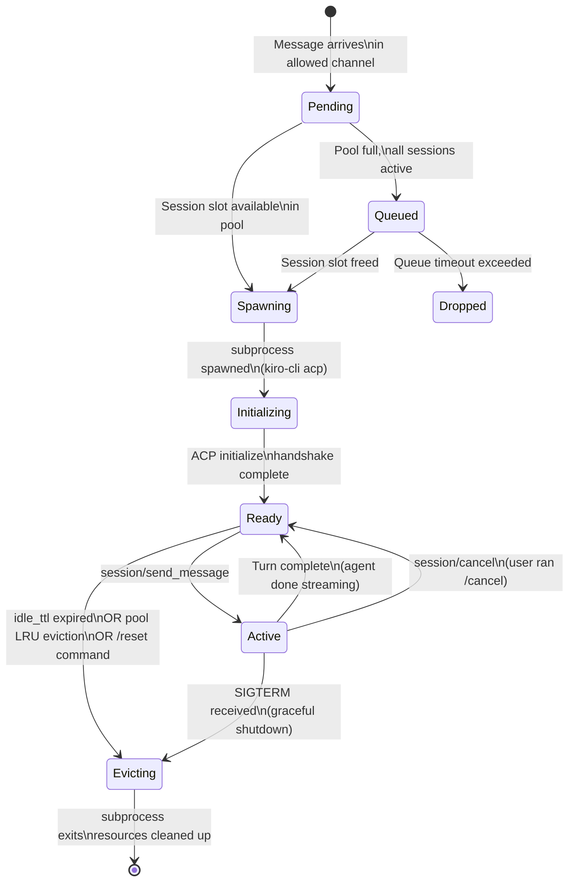
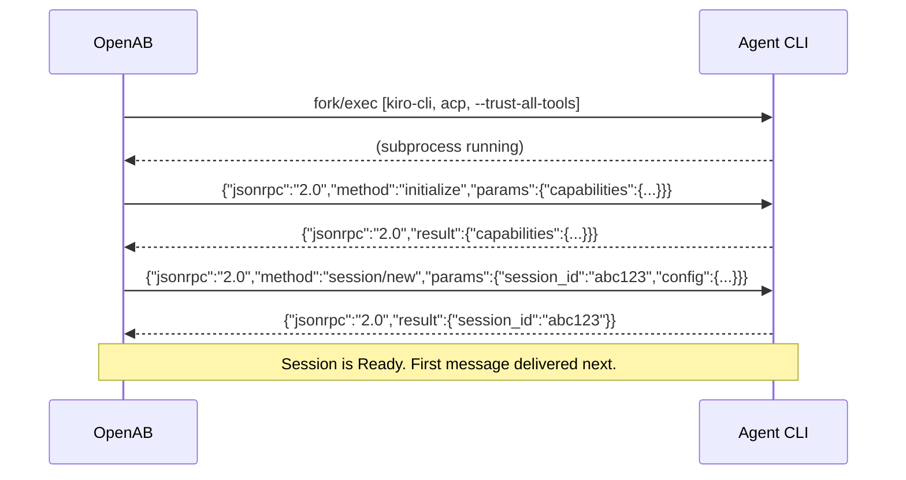

# Session Lifecycle — From First Message to Eviction

The complete state machine for a single conversation thread's session.

## Full Lifecycle



## Key Transitions

### Pending → Spawning vs Queued

When a message arrives for a thread with no session, OpenAB checks the pool:

```
pool.active_count < max_sessions?
  Yes → Spawning (new subprocess immediately)
  No  → Find LRU idle session, evict it → Spawning
  No idle sessions → Queued (wait)
```

### Spawning → Ready (ACP Handshake)



### Active → Ready (Turn Complete)

The agent signals turn completion by sending its final `session/send_message` result. Between turns, the subprocess stays alive — it keeps its in-process state (conversation history, loaded files, etc.) for the next message.

### Ready → Evicting (Graceful)

```
1. OpenAB signals subprocess: SIGTERM
2. Agent saves any in-flight state
3. Agent exits (code 0)
4. OpenAB cleans up working directory (if per_thread_workdir enabled and not preserved)
5. Session removed from pool
```

If the subprocess doesn't exit within 5 seconds of SIGTERM, it receives SIGKILL.

## Session Duration in Practice

| Scenario | Typical lifetime |
|----------|-----------------|
| Quick Q&A thread | Minutes (idle TTL evicts) |
| All-day debugging session | Hours (kept alive by activity) |
| Overnight background task | Until `session_idle_ttl` (default 24h) |
| Cron-triggered task | Ephemeral — spawned, turn complete, evicted |

## What Survives Eviction

**Survives (if per_thread_workdir + S3 backup via pre_shutdown hook):**
- Files written by the agent to its working directory
- Git repositories the agent cloned

**Does not survive:**
- In-memory state (variables, loaded files, conversation context)
- The ACP session itself (next message to that thread gets a fresh session)

This is why long-running agent workflows use hooks to checkpoint to S3 — the session pool doesn't provide persistence.
