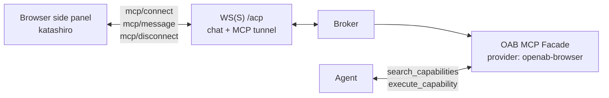

# Let Your Agent Drive the Browser (MCP-over-ACP)

> **Version gate:** Unreleased — on `main` after v0.10.0-beta.2.

Browser control lets an agent read, click, type, navigate, and capture screenshots in the user's real browser. The **katashiro** MV3 side-panel extension serves DOM-semantic MCP tools through a reverse MCP-over-ACP tunnel on the existing `/acp` WebSocket.

## Architecture

Tunnel frames share the same WebSocket as chat traffic and are distinguished by the `mcp/*` method namespace. The agent never sees `katashiro.*` in its direct `tools/list`; it discovers those tools through the facade as provider `openab-browser`.

## Setup

1. Add `[mcp]` to `config.toml`. This is a hard requirement: without it the facade does not start and browser control is unavailable.
2. Enable the `/acp` WebSocket endpoint and configure its transport authentication for the deployment.
3. Connect the katashiro extension. In `session/new` or `session/resume`, it declares its MCP server with `type: "acp"`.
4. Register the facade with the coding CLI and preserve its `Authorization: Bearer ${OPENAB_SESSION_TOKEN}` header.
5. Have the agent call `search_capabilities`; browser tools appear under provider `openab-browser` for that session.

## Browser Tools

| Tool | Purpose |
|------|---------|
| `katashiro.read_dom` | Read a DOM-semantic representation of the current page. |
| `katashiro.screenshot` | Capture the current browser view. |
| `katashiro.navigate` | Navigate the tab to a URL. |
| `katashiro.click` | Click a DOM target. |
| `katashiro.type` | Type into a DOM target. |

## Session Boundaries and Limits

The broker mints a per-session bearer and injects it into that session's agent subprocess. Browser tools are filtered out without the bearer, so other host processes using the unauthenticated facade cannot discover or invoke them.

- Up to 8 ACP-backed MCP servers per session
- Up to 64 in-flight tunnel establishes, with a 30-second connect/handshake timeout
- Tunnel calls bounded by `[mcp] tunnel_timeout_seconds`, default 170 seconds; `mcp/cancel` cancels tunnel calls only
- 8 MiB overall ACP frame cap for screenshot results; method-bearing frames remain capped at 1 MiB
- On `session/resume`, an explicitly supplied `mcpServers` array is authoritative: registered servers absent from it are withdrawn, and `[]` withdraws all. Omitted, null, or malformed `mcpServers` leaves registrations unchanged

## Security Notes

Browser tool permissions remain auto-approved under ADR Decision D1. Agent-to-client request plumbing now exists, but only for the MCP tunnel; it is not wired to chat-facing `session/request_permission`. Fine-grained consent is still deferred.

The default keyless loopback ACP setup has an important edge: with no `OPENAB_ACP_AUTH_KEY` and an empty origin allowlist, a request with no `Origin` header is admitted. Any local non-browser process can therefore attach a `type: "acp"` server and publish callable tools. Transport authentication is the trust boundary; there is no operator-side MCP server allowlist.

Configs containing the removed `[[mcp.acp_servers]]` block now fail to parse. Earlier proxy mode, per-session loopback MCP URLs, and bridge mode (`openab browser-bridge` / `OPENAB_BROWSER_MODE`) were removed before merge. Documentation that recommends them is obsolete; the facade is the sole delivery path.

## What Is Not Here Yet

There is no general `session/request_permission` relay or fine-grained browser-tool consent. Structured `tool_call` updates and progressive token streaming are also still open; chat prompts continue to emit only `agent_message_chunk`. `session/cancel` still does not stop backend agent work, independently of tunnel-call `mcp/cancel`.

## Further Reading

- Upstream: `docs/adr/acp-server-websocket-reverse-mcp.md`
- Upstream: `docs/browser-mcp-agent-setup.md`
- Upstream: `docs/mcp-over-acp-tunnel-contract.md`
- [OAB MCP Facade](../01-core-concepts/mcp-facade.md) — capability discovery and session tokens
- [Drive Your Agent from an ACP Client](./drive-agent-from-acp-client.md) — `/acp` setup and transport behavior
