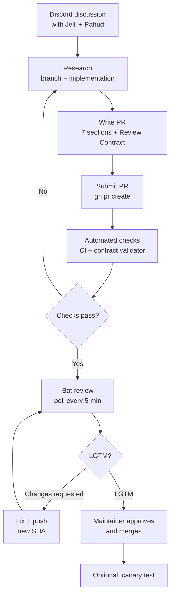
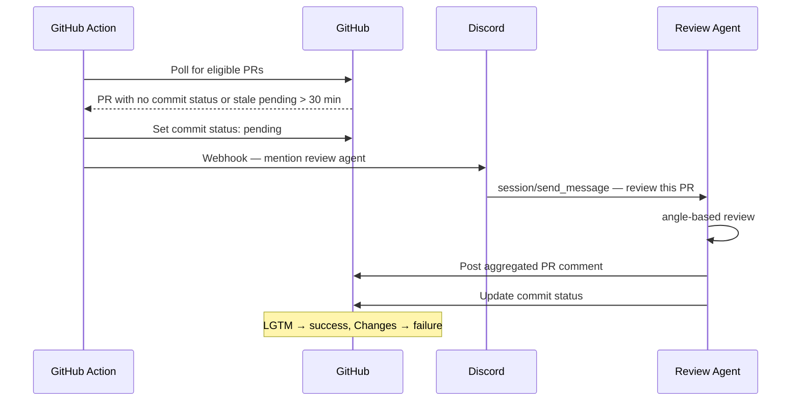

# E2E PR Lifecycle — Contribution to Merge

The full flow for submitting a change to openab, from Discord discussion to merged commit. Based on v0.10.0-beta.2.

---

## Overview



---

## Step 1 — Discord Discussion First

Before writing any code, discuss the use case in Discord. Jelli (the community bot) helps clarify requirements. Once aligned, Pahud (@Pahud) confirms the scenario before implementation begins.

PRs without a Discord Discussion URL in the body are **automatically closed in 24 hours**. This is enforced by CI — not optional.

---

## Step 2 — Research & Implementation

```bash
# Search for related prior work
gh issue list --search "your topic" -R openabdev/openab
gh pr list --search "your topic" --state all -R openabdev/openab
```

For architecture or runtime changes, Prior Art Research is required — at minimum, review how OpenClaw and Hermes Agent handle the same problem.

**Branch naming:**

| Change type | Branch prefix |
|------------|--------------|
| New feature | `feat/<topic>` |
| Bug fix | `fix/<topic>` |
| Documentation | `docs/<topic>` |

**Commit convention:** `feat: ...`, `fix: ...`, `docs: ...`

Keep PRs focused — one logical change per PR.

---

## Step 3 — PR Structure (Required)

Every PR body must include **all 7 sections** plus the Review Contract:

```markdown
## 0. Discord Discussion URL
https://discord.com/channels/...

## 1. What problem does this solve?

## 2. At a Glance
ASCII diagram of the change

## 3. Prior Art & Industry Research

## 4. Proposed Solution

## 5. Why This Approach

## 6. Alternatives Considered

## 7. Validation

## Review Contract

### Goal
What user problem this PR must solve.

### Non-goals
What this PR intentionally does not attempt.

### Accepted Residual Risks
Known failure modes, with mitigations and recovery.

### Acceptance Criteria
Concrete, testable conditions required for LGTM.

### Follow-ups
Hardening or broader changes explicitly deferred.
```

Sections may say `None` or `Not applicable` only if a brief reason is given. No `TBD`, no empty checkboxes.

---

## Step 4 — Submit

```bash
gh pr create -R openabdev/openab \
  --title "feat: short description" \
  --body-file /path/to/pr-body.md
```

---

## Step 5 — Automated Checks

CI runs immediately on PR open:

| Check | What it validates |
|-------|------------------|
| `cargo check` | Compiles without errors |
| `cargo test` | All tests pass |
| `cargo clippy -- -D warnings` | No lint warnings |
| `cargo check --target x86_64-pc-windows-gnu` | Windows compatibility |
| Helm lint | Helm chart validity |
| `needs-rebase` detector | Branch is not stale |
| Review Contract validator | All 5 headings present, no placeholder content |

If the Discord URL is missing → CI immediately labels `closing-soon` → auto-closes in 24 hours.

---

## Step 6 — Automated Bot Review

A GitHub Action polls every 5 minutes for eligible PRs (non-draft, trusted author or `safe-to-review` label):



Maintainers can also trigger review instantly by commenting `/review` on a PR.

---

## Step 7 — Review Loop

```
Review result → LGTM?
  Yes → proceed to merge
  No  → author fixes → git push → new SHA has no status
           → Action picks up on next 5-min poll → re-reviews
```

If the PR has an `auto-fix` label, the review agent will attempt to push fixes automatically (cap: 3 cycles per session, hard cap: 30 cycles per PR).

---

## Step 8 — Review Contract Lifecycle

| Round | Scope |
|-------|-------|
| **Round 1** | Full review + contract freeze. Maintainer confirms Goal, Non-goals, Residual Risks, Acceptance Criteria. |
| **Round 2** | Fix verification. Only: unresolved findings + new changes + regressions + frozen Acceptance Criteria. |
| **Round 3** | Final regression check. |
| **Beyond 3** | Maintainer decides: another focused round, contract revision, or close. |

**Post-freeze blockers** must pass the Late Blocker Gate — concrete evidence that:
- An Acceptance Criterion is not met, OR
- The PR does not achieve the frozen Goal, OR
- A correctness, security, or data-loss defect was introduced

Hypothetical hardening, architecture preferences, and pre-existing unrelated issues do not pass the gate. They go in Follow-ups.

**Finding lineage** (tag post-freeze findings):

| Tag | Meaning |
|-----|---------|
| `ORIGINAL` | Unresolved finding from an earlier round |
| `REGRESSION` | New defect introduced by changes in this PR |
| `NEW EVIDENCE` | Direct new evidence that frozen contract is violated |
| `SCOPE EXPANSION` | Outside frozen Goal — non-blocking, goes to Follow-ups |

---

## Step 9 — Label-Driven Lifecycle

| Label | Meaning | Consequence |
|-------|---------|------------|
| `pending-maintainer` | Ball is in maintainer's court | — |
| `pending-contributor` | Ball is in contributor's court | 2 days silence → `closing-soon` |
| `closing-soon` | Auto-closes in 3 days unless author responds | Author comment resets to `pending-maintainer` |
| `safe-to-review` | Marks external contributor PR as eligible for bot review | — |
| `review-contract-exempt` | Exempts PR from Review Contract check | Requires maintainer decision + documented reason |
| `auto-fix` | Allows review agent to push fixes automatically | Capped at 30 cycles |

> **Fork PR label lag:** Review-event tokens are read-only for fork PRs, so `pending-maintainer`-family label changes come from the hourly reconciliation job instead of immediately. Expect up to about one hour of lag after a review ([PR #1442](https://github.com/openabdev/openab/pull/1442)).

---

## Step 9.5 — Maintainer Take-Over of Fork PRs

GitHub App installation tokens cannot push to fork branches, even when “Allow edits by maintainers” is enabled. When a fork PR needs only small mechanical fixes after its direction is accepted—or its contributor is unresponsive—a maintainer may take over:

1. Agree on the direction before moving the work.
2. Preserve attribution by cherry-picking contributor commits onto an in-repo branch, or, when squashing, adding `Co-authored-by: username <username@users.noreply.github.com>`.
3. Credit `@username` in the replacement PR and link the original with `Supersedes #123`.
4. Finish the remaining nits and merge the replacement.
5. Close the original PR with a comment that credits the contributor.

The contributor can always choose to finish the work instead; take-over is a convenience, not a review bypass. PR #1443 taking over #1440 is the live example. See upstream `CONTRIBUTING.md`, “Maintainer Take-Over of Fork PRs.”

---

## Step 10 — Merge Conditions

All of the following must be satisfied:

- [ ] OpenAB PR Review commit status = `success` (required branch protection check)
- [ ] All frozen Acceptance Criteria satisfied
- [ ] All blocking findings resolved
- [ ] Required CI checks pass

Then: maintainer approves and merges.

---

## Step 11 — Post-Merge (Optional)

Deploy the released image to a canary agent and run validation:

```bash
# Deploy canary with new image tag
helm upgrade canary-bot openab/openab --set image.tag=<new-tag>

# Validate via Discord interaction
@CanaryBot run smoke test
```

See `docs/canary-tests.md` for the full canary test procedure.

---

---

## The 5-Ask Framework

Every PR review — whether by a human or a bot — can be triggered into the 5-Ask format (e.g. via the `5️⃣` emoji reaction). It's a structured way to evaluate any proposed change in under 5 minutes.

| # | Question | What you're really checking |
|---|----------|----------------------------|
| 1 | **What problem does it solve?** | Is the problem real, clearly scoped, and worth solving now? |
| 2 | **What alternatives were considered?** | Was the solution space explored, or was the first idea shipped? |
| 3 | **How does it solve it?** | Is the mechanism sound? Any hidden complexity? |
| 4 | **What are the limitations and risks?** | Known failure modes, restart behavior, scope boundaries, data loss potential |
| 5 | **Is this the best approach?** | Given the constraints, is this the lightest viable solution? |

### Example — PR #1165: LINE Group Context Buffer

**1. What problem does it solve?**

In LINE group chats, the bot only receives messages when @mentioned. When a user says "@bot summarize this," the bot has no context of what came before the mention.

**2. What alternatives were considered?**

| Option | Why rejected |
|--------|-------------|
| Dispatch all group messages to OpenAB | Requires changing core `admitted turn` semantics |
| Use LINE Push API to actively participate | Changes product behavior, consumes Push API quota |
| Persist to long-term memory store | This is short-term context only — persistence is overkill |

**3. How does it solve it?**

The gateway maintains an in-memory `VecDeque` buffer per chat. Non-@mention text messages are stored in the buffer. When the bot is @mentioned, the buffer is drained and prepended as context. Opt-in via `LINE_GROUP_CONTEXT_ENABLED=true`, default off.

**4. What are the limitations and risks?**

- Buffer is lost on restart (pure in-memory)
- Only buffers text — non-text messages still dropped
- Sender identified by LINE UID, not display name (display-name lookup out of scope)
- Single gateway instance — not shared across pods

**5. Is this the best approach?**

Yes. Lightest viable solution given current architecture:
- Does not change core admission semantics
- No external storage required
- Bounded (24h TTL / 100 messages / 8000 characters)
- Fully opt-in, zero regression risk
- 8 tests covering all boundary cases

---

## Further Reading

- `CONTRIBUTING.md` — full contributor guide
- `docs/review-contract.md` — Review Contract policy (Late Blocker Gate, freeze lifecycle, stopping rule)
- `.github/workflows/pr-bot-review.yml` — bot review workflow source
- `docs/adr/pr-contribution-guidelines.md` — ADR for PR structure requirements
- [Reactions Mapping](../01-core-concepts/reactions-mapping.md) — emoji as agent control panel (includes `5️⃣` trigger)
