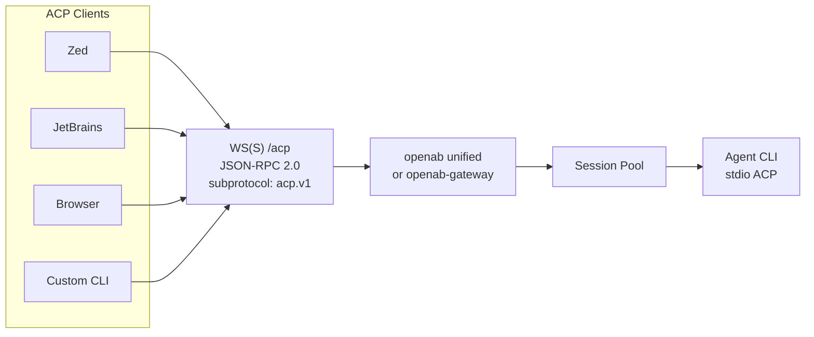

# Drive Your Agent from an ACP Client (Zed, JetBrains, Browser, CLI)

OpenAB can act as an ACP server: any standard ACP client connects to `GET /acp` over WebSocket and drives your agent, with no per-frontend adapter needed. This is new in v0.10.0-beta.2 ([PR #1418](https://github.com/openabdev/openab/pull/1418)).

## Architecture



## The Direction Reversal

OpenAB has historically been an ACP *client*: it spawns agent subprocesses and speaks ACP over stdio. As of v0.10.0-beta.2, it is *also* an ACP *server*.

Unlike a local stdio bridge, the server endpoint lets remote clients and browser pages connect directly. Both `openab-gateway` and unified `openab run` serve the endpoint; an ACP-only unified deployment still starts the embedded HTTP server even when no chat platform is configured. The endpoint itself is plain WebSocket; TLS for production connections comes from your ingress or proxy.

## Enable It

The `acp` Cargo feature enables server support and is included in the `unified` feature bundle. Runtime access is disabled by default.

| Environment variable | Default | Purpose |
|----------------------|---------|---------|
| `OPENAB_ACP_ENABLED` | Disabled | Set to `true` or `1` to enable the ACP endpoint. |
| `OPENAB_ACP_AUTH_KEY` | Unset | Bearer key for transport authentication. An empty string is treated as unset. |
| `OPENAB_ACP_ALLOWED_ORIGINS` | Empty | Comma-separated exact browser origins allowed in keyless mode. Empty blocks all browser origins. |
| `OPENAB_ACP_TRACE` | Disabled | Set to `true` or `1` to log every JSON-RPC frame in both directions. |
| `GATEWAY_ALLOW_ALL_USERS` | Disabled | Admit the synthetic ACP sender through the broker trust registry. |
| `GATEWAY_ALLOWED_USERS` | empty — all ACP prompts denied until `acp_client` is admitted (or `GATEWAY_ALLOW_ALL_USERS=true`) | Include `acp_client` instead of allowing every user. |

**Minimal local development:** bind to loopback, set `OPENAB_ACP_ENABLED=true`, and either set `GATEWAY_ALLOW_ALL_USERS=true` or include `acp_client` in `GATEWAY_ALLOWED_USERS`. Keyless mode is allowed only on `127.0.0.0/8`, `::1`, or `localhost`. Non-browser clients can connect without an `Origin` header.

**Remote deployment:** set `OPENAB_ACP_ENABLED=true`, configure `OPENAB_ACP_AUTH_KEY`, and admit `acp_client` through the broker trust registry. Non-browser clients present the key as `Authorization: Bearer <key>`. On a non-loopback bind, a missing key causes OpenAB to refuse to mount `/acp` entirely.

## Browser Authentication

Browsers cannot set an `Authorization` header during a WebSocket upgrade. Supply the bearer key through WebSocket subprotocols instead:

```text
Sec-WebSocket-Protocol: openab.bearer.<key>, acp.v1
```

OpenAB echoes `acp.v1` on upgrade. In keyless mode, browser requests are default-denied unless their exact `Origin` appears in `OPENAB_ACP_ALLOWED_ORIGINS`; requests without `Origin` are admitted. The keyed path ignores `Origin`.

Keys never belong in URLs. Query-string authentication such as `?token=` is not supported because URLs leak into logs, browser history, and intermediaries.

## Phase 1 Method Support

| Method | Status | Phase 1 behavior |
|--------|--------|------------------|
| `initialize` | Supported | Uses wire `protocolVersion: 1`, official agent capabilities, and `authMethods: []`. |
| `session/new` | Supported | Accepts `{cwd, mcpServers}` and returns `{sessionId}`. |
| `session/resume` | Supported | Accepts `{sessionId, cwd}` and immediately returns `{}` for any well-formed `sess_<uuid>`; it does not check session liveness or replay history. |
| `session/prompt` | Supported | Sends `session/update` notifications and returns snake_case `stopReason`: `end_turn` or `cancelled`. |
| `session/cancel` | Partial | Ends the waiter as `cancelled`, but does not stop backend agent work. |
| `session/update` | Agent → client | Sends text-only `agent_message_chunk` notifications. |
| `authenticate`, `logout` | Not supported | Not part of the Phase 1 chat subset. |
| `session/load` | Not supported | History replay is deferred. |
| `session/close`, `session/list`, `session/delete`, `session/set_config_option`, `session/set_mode` | Not supported | Session administration is deferred. |
| `session/request_permission` | Not supported | There is no agent-to-client request direction yet. |
| `fs/*`, `terminal/*` | Not supported | Deferred beyond Phase 1. |

Phase 1 conforms to official ACP Schema v1.19.0. A whole reply currently arrives as one terminal `agent_message_chunk` before `session/prompt` returns. ACP clients receive only the raw answer text; tool activity is not surfaced in Phase 1.

## Resume a Session

`session/new` returns an ID in the form `sess_<uuid>`. For any well-formed ID in that format, `session/resume` returns `{}` immediately without checking whether the underlying agent session is still alive. It does not replay history; `agentCapabilities.loadSession` remains `false`.

The gateway cannot observe session liveness. If the agent pool has expired the session—`session_ttl_hours` defaults to four hours—the next prompt silently starts a fresh session, and its first reply is prefixed with a `Session expired` notice that the client can surface.

## Limits and Known Limitations

Hard limits per WebSocket connection:

- 128 sessions across `session/new` and `session/resume`
- 32 in-flight prompts; overflow returns JSON-RPC error `-32000`
- 1 MiB maximum inbound frame

Phase 1 limitations:

- `session/cancel` does not stop backend agent work.
- Replies use single-chunk delivery rather than progressive token streaming.
- Tool activity is not surfaced at all, and there are no permission prompts; tools follow broker auto-trust configuration.
- A session's reply route closes after its first delivered chunk, leaving a known long-reply edge case.

## Verify It Works

Run the uv-compatible `scripts/acp-ws-smoke.py` verification tool. It performs seven checks against the WebSocket transport; the same transport is covered in `docs/canary-tests.md` under “WebSocket transport (/acp).”

## Roadmap

**Phase 2 critical path:**
- Agent-to-client request direction and `session/request_permission`
- Progressive streaming and structured `tool_call` updates
- MCP-over-ACP tunnel

**Phase 3 and later:**
- `session/load` history replay and session administration
- Thought chunks and plans
- Filesystem, terminal, image, and audio support
- Streamable HTTP (POST + SSE) transport

Multi-agent fan-out remains a client-side concern and is explicitly out of scope.

## Further Reading

- [ACP](../01-core-concepts/acp.md) — OpenAB's two ACP roles
- [Which Adapter?](../04-decision-trees/which-adapter.md) — chat adapters versus the ACP endpoint
- Upstream: `docs/adr/acp-server-websocket-base.md` — Phase 1 decision
- Upstream: `docs/adr/acp-server-websocket.md` — full vision
- Upstream: `docs/adr/acp-server-websocket-mcp-browser.md` — MCP and browser follow-up
- Upstream: `docs/acp-official-methods.md` — official method matrix
- [PR #1418](https://github.com/openabdev/openab/pull/1418)
