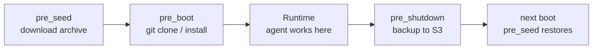

# Hook Into the Lifecycle

Use pre_boot and pre_shutdown hooks to bootstrap a workspace before the agent starts and persist it after shutdown.

## Common Pattern: Clone → Work → Back Up



## Example 1: Clone a Repo at Boot

The agent needs `~/myapp` to exist before it starts:

```toml
[hooks.pre_boot]
inline = '''#!/bin/sh
set -e
git clone https://github.com/myorg/myapp ~/myapp
cd ~/myapp && npm ci
'''
```

The agent's working directory is now `~/myapp` at first message.

## Example 2: S3 Workspace Persistence

Clone is slow. Use S3 to snapshot the workspace and restore it at next boot:

```toml
[hooks.pre_seed]
inline = '''#!/bin/sh
set -e
if aws s3 ls s3://my-bucket/workspace.tar.gz 2>/dev/null; then
  aws s3 cp s3://my-bucket/workspace.tar.gz /tmp/workspace.tar.gz
  tar -xzf /tmp/workspace.tar.gz -C ~/
  echo "Workspace restored from S3"
else
  echo "No snapshot found, fresh start"
fi
'''

[hooks.pre_boot]
inline = '''#!/bin/sh
set -e
if [ ! -d ~/myapp ]; then
  git clone https://github.com/myorg/myapp ~/myapp
  cd ~/myapp && npm ci
fi
'''

[hooks.pre_shutdown]
inline = '''#!/bin/sh
set -e
tar -czf /tmp/workspace.tar.gz ~/myapp
aws s3 cp /tmp/workspace.tar.gz s3://my-bucket/workspace.tar.gz
echo "Workspace backed up to S3"
'''
```

First boot: pre_seed finds no archive → pre_boot clones fresh.
Subsequent boots: pre_seed restores archive → pre_boot skips clone (directory exists).
Shutdown: pre_shutdown backs up latest state.

## Example 3: Remote Script (with SHA-256)

```toml
[hooks.pre_boot]
url = "https://raw.githubusercontent.com/myorg/scripts/main/bootstrap.sh"
sha256 = "a1b2c3d4e5f6..."   # required — prevents TOCTOU
```

SHA-256 is verified before execution. If the script at the URL doesn't match, OpenAB exits with an error. Never omit this for remote hooks.

## Environment Available in Hooks

```bash
# Always available
HOME=/home/openab
PATH=/usr/local/bin:/usr/bin:/bin
USER=openab

# AWS (if pod has IAM role)
AWS_REGION=us-east-1
AWS_DEFAULT_REGION=us-east-1
# (credentials via IMDS, not env vars)
```

Secrets from `config.toml` (bot tokens, API keys) are NOT in the hook environment. If your hook needs credentials, use IAM roles (for AWS) or the exec secret provider.

## Failure Behavior

```toml
[hooks.pre_boot]
inline = '''#!/bin/sh
git clone https://github.com/myorg/private-repo ~/myapp   # fails if no auth
'''
```

If this exits non-zero, **OpenAB exits immediately** — the agent pool never starts. This is intentional: better to fail loudly at boot than to have the agent work in a broken environment.

Use `set -e` in all hooks to propagate errors properly.

## Debugging Hooks

Hook stdout/stderr goes to the OpenAB container logs:

```bash
kubectl logs -f pod/openab-xxx -c openab | grep -i hook
```

Or locally:

```bash
RUST_LOG=debug openab run -c config.toml 2>&1 | grep hook
```
