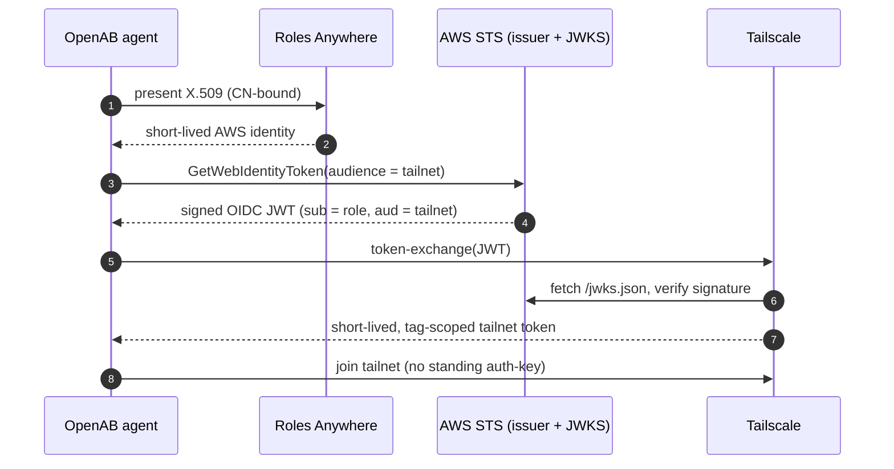
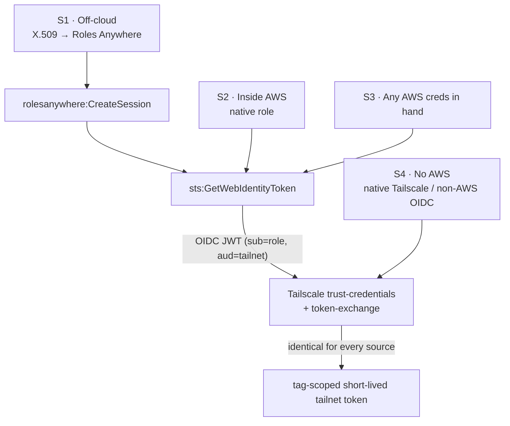
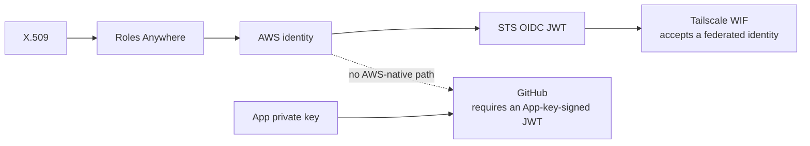

# Keyless AWS and Tailnet Access for Off-Cloud Agents

An OpenAB agent running outside AWS can obtain scoped, short-lived credentials for AWS and a Tailscale tailnet without storing any long-lived secret in the container — no static access key, no tailnet auth-key. Each credential is minted on demand and expires on its own.

This is a community-contributed pattern, not an OpenAB-official standard. It layers on top of OpenAB: OpenAB stays the [thin broker](../00-what-is-openab.md), and credential identity is owned in the layer above it. Roadmap items are tagged **[Today]** / **[Proposed]** / **[Vision]** so nothing aspirational reads as shipped.

**Why the title names AWS and the tailnet, and not GitHub.** GitHub sits deliberately outside the claim: the reference deployment's GitHub leg still puts a long-lived App private key in the agent runtime and lets each agent mint its own installation tokens. That is not an implementation gap — it is the ceiling of what a federated AWS identity can reach, and closing it needs a component this pattern does not itself provide. See [The GitHub leg](#the-github-leg--where-aws-identity-runs-out).

Even on the legs it does cover, trust rests on durable controls configured out-of-band — an X.509 trust anchor, IAM role trust policies, KMS key policies, and tailnet config. Only the credential the agent actually holds is short-lived and scoped. (A stricter term is *long-lived-secretless*.)

## The problem

Attaching a long-lived AWS access key to a machine creates a credential that never expires, is trivially copied, can leak in a commit, and gives no signal about which host lost it. The same applies to a static Tailscale auth-key or a GitHub PAT baked into a container.

This pattern removes the first two from the runtime entirely and replaces them with short-lived, scoped, verifiable tokens. **It does not solve the third** — the GitHub leg trades N PATs for one App private key, which is a smaller number of long-lived secrets but not zero. That asymmetry is the most interesting thing on this page, and the last two sections are about why it exists and what closes it.

## The credential chain (off-cloud → AWS → tailnet)

An off-cloud agent reaches a tailnet in three legs:

1. **AWS identity — IAM Roles Anywhere.** A self-managed private CA is registered as a trust anchor. The agent presents a short-lived X.509 certificate (private key ideally TPM-sealed); `aws_signing_helper` calls `rolesanywhere:CreateSession` and receives a short-lived AWS identity. The role is bound to the certificate's Common Name.
2. **OIDC token — AWS STS.** STS Outbound Identity Federation makes the AWS account an OIDC issuer with a public JWKS. The AWS identity calls `sts:GetWebIdentityToken` with an audience and receives a signed JWT (`sub` = role, `aud` = tailnet). The signing key never leaves AWS's HSM. This replaces the older self-hosted KMS/Lambda OIDC broker.
3. **Tailnet token — Tailscale WIF.** The tailnet is configured (trust-credentials) to trust the account's issuer URL. Its token-exchange endpoint verifies the JWT against the JWKS, matches `sub`/`aud`, and returns a short-lived, tag-scoped tailnet token. No standing auth-key is stored.



## Credential sources are pluggable

Only the first leg differs by where the agent runs; the tailnet side is identical for every source.



- **S1 — Off-cloud (X.509 → Roles Anywhere).** The general case: works anywhere and binds to hardware under your control. **[Today]**
- **S2 — Inside AWS (native role).** A Fargate/EC2/Lambda/SSO identity skips leg 1 — fewest moving parts. **[Today]**
- **S3 — Any AWS credential already in hand.** Any SigV4-signable principal can start at leg 2; useful when migrating off a legacy static key. **[Today]**
- **S4 — No AWS (native Tailscale OAuth or non-AWS OIDC).** Uses Tailscale's own OAuth/auth-key or a non-AWS OIDC issuer (GitHub Actions, GCP, Azure). Skips AWS entirely; trades away AWS identity as a common hub. **[Today]**

| Agent runs… | Credential | Own CA? | AWS? | Keyless? | Tailnet side |
|---|---|---|---|---|---|
| Off-cloud | X.509 → Roles Anywhere *(S1)* | yes | yes | ✔ | **identical** |
| Inside AWS | native AWS role *(S2)* | no | yes | ✔ | **identical** |
| Anywhere w/ AWS creds | existing token *(S3)* | no | yes | ✔/△ | **identical** |
| Anywhere, no AWS | Tailscale / non-AWS OIDC *(S4)* | no | no | ✔ | **identical** |

In the reference fleet, S1 carries the always-on off-cloud lead host and S2 carries every containerised agent; both land on the same tailnet tag.

## Persisting the few inputs that must survive

Two mint-time inputs must persist somewhere the agent can read: the Tailscale **client-id** and the **audience** derived from it (`api.tailscale.com/<client-id>`).

**Neither is a secret.** Tailscale's own setup instructions say so explicitly — both values are visible in the admin console — so they do not need a secret carrier. A plain SSM `String` parameter or a config file is sufficient, and that is what the reference deployment uses: read without `--with-decryption`, producing no `kms:Decrypt` call.

This matters for more than tidiness. The reference role below explicitly denies `ssm:GetParameter*` **and** `kms:Decrypt`, so if these two values were SecureStrings the minting role could not read them at all. Storing non-secrets in a secret carrier does not add security; here it would have broken the flow.

**Genuine secrets are a separate class with a separate reader.** Values that really are secret — a GitHub App private key, agent API tokens, webhook URLs — live in SSM SecureString and are read by a *different* principal (the container's task role), never by the read-only minting role above. For that class the scoped-vault shape is worth the effort:

- **Path-scoped decryption.** Path-based IAM (`Resource: …:parameter/prefix-*`) plus a per-principal KMS grant means each principal decrypts only its own parameters — two independent checks (`ssm:GetParameter*` **and** `kms:Decrypt`).
- **No native rotation.** Parameter Store does not rotate (that is Secrets Manager). Its dynamic levers are parameter policies (TTL/expiration + EventBridge, Advanced tier) and versioning.
- **Per-application CMKs.** A hardened variant replaces the default SSM key with per-application customer-managed KMS keys, grants each task role `kms:Decrypt` on only its own key, and alerts (EventBridge + SNS) on any read by a non-agent principal. This favours SSM SecureString over Secrets Manager: cheaper, KMS-isolated, path-scoped, and audited, accepting "no native rotation" as the trade. **[Today]**

The split is the point: the minting role is denied every secret-read API, and the values it *does* need are not secrets. Note the limit of what this buys, though — a scoped vault controls *who may retrieve* a secret, never what happens to it afterwards. See [Blast radius](#blast-radius-and-residual-risk).

See [Secrets Strategy](../04-decision-trees/secrets-strategy.md) for the adjacent question: OpenAB's *own* secrets (bot tokens, adapter credentials) are resolved once at boot by the OpenAB process and never handed to an agent. This page is about the other category — credentials an agent workload mints and uses at runtime.

## Reference configuration

One working Roles Anywhere setup for an always-on host that holds a read-only AWS role and also mints tailnet tokens. This is a reference, not a prescribed standard.

- **Self-managed CA:** private key kept offline; only the public CA certificate is registered as a `CERTIFICATE_BUNDLE` trust anchor.
- **Leaf certificate:** `CN=host-01`, ~90-day validity; key never leaves the host.
- **Role trust bound to the CN:** `aws:PrincipalTag/x509Subject/CN == host-01`, plus `sts:TagSession` and `sts:SetSourceIdentity`.
- **Confused-deputy guard:** `ArnEquals aws:SourceArn == <trust anchor ARN>`. AWS strongly recommends this, and it is doing real work: CN-binding alone assumes nobody can register a *second* trust anchor in the account — an external condition, not an invariant you control. With `aws:SourceArn` pinned, a second anchor cannot map into this role even if it can sign a leaf with the same CN.
- **Permissions:** `ViewOnlyAccess` baseline plus named read-only diagnostics (CloudTrail LookupEvents, Logs read, Cost Explorer, Batch describe).
- **Explicit deny on secret-read and role-pivot** — see the two wildcard notes below.
- **Tailnet minting grant:** `sts:GetWebIdentityToken`, audience-locked and duration-capped. This action is **outside** the `AssumeRole*` family, so the deny below does not cover it — review it separately.
- **Profile:** 1-hour sessions. **Renewal:** a scheduled check flags leaf expiry. **Revocation:** see [Blast radius](#blast-radius-and-residual-risk) — it is layered, and the trust anchor only reaches the first layer.

```python
# CDK (trimmed; account/ARNs redacted)
anchor = ra.CfnTrustAnchor(self, "FleetCaAnchor", name="fleet-ca", enabled=True,
    source=ra.CfnTrustAnchor.SourceProperty(
        source_type="CERTIFICATE_BUNDLE",
        source_data=ra.CfnTrustAnchor.SourceDataProperty(x509_certificate_data=FLEET_CA_PEM)))

trust = {"StringEquals": {"aws:PrincipalTag/x509Subject/CN": "host-01"},
         "ArnEquals":    {"aws:SourceArn": anchor.attr_trust_anchor_arn}}
role = iam.Role(self, "RaTelescope", role_name="ra-telescope-ro",
    assumed_by=iam.PrincipalWithConditions(iam.ServicePrincipal("rolesanywhere.amazonaws.com"), trust),
    managed_policies=[iam.ManagedPolicy.from_aws_managed_policy_name("job-function/ViewOnlyAccess")])
role.assume_role_policy.add_statements(iam.PolicyStatement(
    actions=["sts:TagSession", "sts:SetSourceIdentity"],
    principals=[iam.ServicePrincipal("rolesanywhere.amazonaws.com")], conditions=trust))

role.add_to_policy(iam.PolicyStatement(sid="TailscaleWIF",
    actions=["sts:GetWebIdentityToken"],
    resources=[f"arn:aws:sts::{self.account}:self"],           # mint only for self
    conditions={
        # Audience is Audience.member.N — MULTI-VALUED. A bare StringEquals fails closed.
        "ForAllValues:StringEquals": {"sts:IdentityTokenAudience": TAILNET_AUDIENCE},
        # DurationSeconds is optional (60–3600, default 300); absent unless the caller
        # passes it, so a bare NumericLessThanEquals would deny every call.
        "NumericLessThanEqualsIfExists": {"sts:DurationSeconds": "300"},
    }))

role.add_to_policy(iam.PolicyStatement(sid="DenySecretsAndPivot", effect=iam.Effect.DENY,
    actions=["ssm:GetParameter*",                                  # wildcard, not enumerated
             "secretsmanager:GetSecretValue*", "secretsmanager:BatchGetSecretValue*",
             "kms:Decrypt", "kms:ReEncrypt*",
             "s3:GetObject*",
             "sts:AssumeRole*", "sts:AssumeRoot"],                 # AssumeRoot is NOT AssumeRole*
    resources=["*"]))

profile = ra.CfnProfile(self, "RaProfile", name="ra-telescope-ro",
    enabled=True, duration_seconds=3600, role_arns=[role.role_arn])
```

Two notes on that deny statement, both learned by getting them wrong first:

- **Wildcard the deny; do not enumerate.** An enumerated list missed `ssm:GetParameterHistory`, which returns parameter values just like `GetParameter`. The same shape of gap exists for `s3:GetObjectVersion` / `GetObjectAttributes` and `secretsmanager:BatchGetSecretValue`. A deny face costs nothing to widen when the principal should touch none of these APIs, and a wildcard covers value-returning APIs that do not exist yet.
- **`sts:AssumeRoot` needs its own entry.** `sts:AssumeRole*` expands from the literal prefix `AssumeRole`, so it covers `AssumeRole`, `AssumeRoleWithSAML`, and `AssumeRoleWithWebIdentity` — and nothing else. `AssumeRoot` is a separate action whose name is not that prefix plus a suffix, so the wildcard never reaches it. The highest-privilege pivot in the account falls just outside the wildcard that looks like it closed the pivot surface.

`kms:Decrypt` in particular is not decorative: any API that returns a KMS-encrypted value decrypts using the *caller's* credentials, so this explicit deny keeps such values masked even where a read permission exists elsewhere in the policy.

> **Correction — verified 2026-08-04, `ap-northeast-1`.** An earlier version of this write-up reported that `sts:IdentityTokenAudience` and `sts:DurationSeconds` were *not present in this API's request context*, and advised bounding the risk procedurally instead. **That was a misdiagnosis of operator error, and the guidance is withdrawn.** Both keys exist and both are enforced in the deployed policy above, confirmed by reading the live inline policy back from IAM. The original failure had two causes, each visible in the API contract:
> - `Audience` is `Audience.member.N`, an array of 1–10 strings, so `sts:IdentityTokenAudience` is **multi-valued**. A bare `StringEquals` against a multi-valued key fails **closed** — which reads exactly like "the key is absent." Use `ForAllValues:StringEquals`.
> - `DurationSeconds` is an **optional** parameter (60–3600, default 300) and is only injected into the request context when the caller passes it. A bare `NumericLessThanEquals` therefore denies every call that omits it. Use `NumericLessThanEqualsIfExists`.

## Runbook

```bash
# One-time per account: turn STS into a recognised OIDC issuer
aws iam enable-outbound-web-identity-federation
aws iam get-outbound-web-identity-federation-info
#   → IssuerUrl https://<unique-id>.tokens.sts.global.api.aws  (+ /.well-known/openid-configuration, /jwks.json)

# Agent already holding an AWS identity (via S1/S2/S3): mint an OIDC JWT.
# GetWebIdentityToken is NOT on the STS global endpoint — without this you get InvalidAction.
export AWS_STS_REGIONAL_ENDPOINTS=regional
aws sts get-web-identity-token \
  --audience "api.tailscale.com/<client-id>" \
  --signing-algorithm RS256 \
  --duration-seconds 300 \
  --query WebIdentityToken --output text > travel.jwt
```

`--signing-algorithm` is **required** (`RS256` or `ES384`); omitting it is a request error, not a default. `--duration-seconds` is optional (60–3600, default 300) — but if the minting role caps it with `sts:DurationSeconds`, pass it explicitly and stay under the cap.

Then exchange the JWT for a tailnet credential. Pick one of three paths, easiest last:

```bash
# (a) API token — form-encoded client_id + jwt (not RFC-8693 grant_type parameters)
curl -s https://api.tailscale.com/api/v2/oauth/token-exchange \
  -d client_id="<client-id>" \
  -d jwt="$(cat travel.jwt)"

# (b) Register a node, supplying the JWT yourself — Tailscale client v1.90.1+
tailscale up --client-id="<client-id>" --id-token="$(cat travel.jwt)" --advertise-tags="tag:openab-agent"

# (c) Register a node, letting the client fetch the JWT — Tailscale client v1.94.0+
#     Auto-detects AWS (IAM role), GCP (metadata server), GitHub Actions (id-token: write).
#     No GetWebIdentityToken call of your own; this is the S2 in-AWS path in one line.
tailscale up --client-id="<client-id>" --audience="api.tailscale.com/<client-id>" \
             --advertise-tags="tag:openab-agent"
```

Path (c) is what containerised agents on AWS should use — it removes the JWT-handling code entirely. Note `--id-token` in (b) takes the **signed OIDC JWT**, not a short-lived Tailscale API token; passing the wrong one fails in a way the error message does not explain.

**Tailscale trust-credentials:** set `Issuer` = the account IssuerUrl, `Audience` = `api.tailscale.com/<client-id>`, `Subject` = the exact role ARN (no wildcards), and assign minimal `Tags` and `Scopes`. Node registration additionally requires the `auth_keys` scope, and tags in `--advertise-tags` must match the tags configured on the federated identity. `--client-id` accepts URL-style parameters — `ephemeral` (default `true`) and `preauthorized` (default `false`).

**Diagnosing a rejected exchange.** Tailscale deliberately returns vague errors so a client-id holder cannot reverse-engineer an identity's configuration. Debug from your side: decode the JWT and check `iss`, `sub`, and `aud` against what trust-credentials expects — `sub` must be the exact role ARN, and a Roles Anywhere session's role ARN is not always the ARN you assume it is.

## The GitHub leg — where AWS identity runs out

The three legs above end at a tailnet. They do not reach GitHub, and the reason is structural rather than a gap in the implementation. This section records what the reference deployment actually does about that, why it is the ceiling of what AWS identity alone can reach, and what has to exist above that ceiling.

### [Today] What the reference deployment runs

A GitHub App is installed on the accounts and organizations holding the fleet's repositories. Every agent that needs GitHub access holds the App's **private key** and mints its own tokens:

- **Containerised agents (S2)** fetch the key at use time with `ssm get-parameter --with-decryption` against an SSM SecureString parameter, using the task role. The decrypted PEM lands in the agent's process memory, and the agent signs a ~9-minute RS256 JWT with it.
- **The off-cloud host (S1)** keeps the same key as a PEM file on local disk, outside the agent's working tree, and signs the same way.

Both then call `POST /app/installations/{id}/access_tokens` and cache the resulting ~1-hour installation token on local disk. Installations are resolved per repository owner and cached separately — a token minted for one installation is not valid for another's repositories, and sharing a cache across installations produces 403s that read like "the agent lost write access."

**This is not keyless, and the gap is not small.** Four properties are materially weaker than the AWS/tailnet legs:

- **A long-lived private key lives in the agent runtime.** Fetching it through a role does not change this. The role controls *who may download the key*; it does not shorten the key's life, scope what the key can do, or record what was done with it. Once decrypted, the PEM is an ordinary secret in an ordinary process — copyable, dumpable from memory, and identical on every agent that reads it.
- **Tokens carry the whole installation's scope.** The App-token API accepts `repositories` and `permissions` to cut a token down to an exact repo set and a minimal permission envelope. The reference helper passes neither, so every minted token can reach every repository in that installation with the App's full permission set.
- **One cache serves every purpose.** The same cached token answers a `git push` credential request and an API call. A push therefore leaves a token on disk that can also open issues, merge PRs, and drive Actions.
- **A static PAT fallback exists** for when minting fails — a second long-lived credential on the host.

What it does buy, honestly stated: one revocable key instead of one PAT per agent per scope, with GitHub logging every issuance and rotation being a single operation at the App rather than an inventory exercise across humans. That is a real improvement over PATs. It is not the property the AWS and tailnet legs have.

### The ceiling: why a role cannot close this

Legs 1–3 work because Tailscale implements workload identity federation: it accepts an OIDC JWT from a trusted issuer and exchanges it for its own credential. GitHub has no equivalent. It does not consume OIDC tokens from arbitrary issuers, and it will not accept an AWS identity as proof of anything. The only credential that opens the installation-token endpoint is a JWT signed by the App's own private key.

So the chain has a hard discontinuity at GitHub:



No AWS service will sign that JWT for you. Roles Anywhere ends at an AWS identity; `GetWebIdentityToken` ends at an OIDC JWT that GitHub does not accept. **The federated chain simply stops here**, and something holding the App private key has to bridge the gap.

That "something" is a credential broker — and here is the part worth being precise about: **a broker is not optional, only its shape is.** Today every agent *is* one. Each holds the key, mints without policy, and keeps no ledger. The design question is not whether to introduce a broker; it is whether there are N unaudited ones or one audited one.

### Why a broker service is the right shape

Collapsing N copies into one component is not merely tidier. Each defect listed above dissolves at the same time, and none of them can be fixed while the key is distributed:

- **The key leaves the agent runtime entirely.** Agents authenticate to the broker and receive only a token. The blast radius of a compromised agent drops from "can mint any token this installation allows, forever" to "holds one token, already narrowed, for under an hour." This is the property the AWS and tailnet legs already have, extended to GitHub — and it is unreachable as long as agents sign for themselves.
- **Mint-time narrowing becomes enforceable rather than aspirational.** A broker knows which agent is asking, so it can pass `repositories` and `permissions` per request. That matters because **GitHub then enforces the boundary itself**, independently of the broker's own argument parsing — the policy holds even if the broker's checks are wrong.
- **Purpose separation stops being a convention.** A git credential can be minted as exactly one repository with `contents:write` and cached under its own key, so a push can never yield a token that also reaches issues, PRs, or Actions. Distributed agents sharing one cache cannot express this distinction at all.
- **Policy gains somewhere to live.** A default-deny allowlist per agent — which repos, which operations — needs a component that sees requests. Distributed minting has no such point; the only enforcement available is whatever GitHub was already going to do.
- **Attribution and revocation get a ledger.** One audited issuance point answers "which agent obtained what, when, for which repository" and revokes centrally. N agents minting independently leave only GitHub's view, where every action is attributed to the App.
- **Rotation becomes one operation.** Replacing a distributed key means touching every host and every cache, with a window where some agents hold the old key and some the new. One broker makes it a single restart.

This is the case for a broker as a **service** rather than a library: the value comes precisely from the key living somewhere the agent is not.

### [Proposed] / [Vision] octobroker, and how it would attach

[octobroker](https://github.com/openabdev/octobroker) is a project built on exactly this thesis — its stated position is that *the agent never holds any GitHub credential*, at most a revocable broker key that is useless against GitHub directly. Its design carries several decisions that read as field-earned rather than theoretical, and that map one-to-one onto the defects above: installation tokens minted with the `repositories` parameter so GitHub owns the boundary; git credentials issued as a single repository with `contents:write` in a separate cache namespace; a conservative read/write classifier where unknown operations count as writes; deny-if-unresolvable repository checks; and a fail-closed audit trail where a record that cannot be persisted rejects the action instead of proceeding unlogged.

Two things must be said plainly:

- **octobroker is a standalone community project, not an OpenAB component.** OpenAB neither ships nor requires it, and the reference deployment described on this page **does not run it**. Nothing above should be read as reporting a deployed state.
- **An OpenAB deployment can consume it** by registering the broker as a downstream provider in the [MCP Facade](../01-core-concepts/mcp-facade.md)'s `mcp.json`. That composition works because the facade dispatches downstream as native `tools/call` requests, so a broker applying policy by real tool name keeps its per-tool allowlists effective instead of seeing every request as the facade's `execute_capability` wrapper.

Two caveats before treating any of this as a plan:

- The pluggable-backend refactor that would let one broker carry more than GitHub is an open RFC ([octobroker#54](https://github.com/openabdev/octobroker/issues/54)) — a pure refactor extracting `CredentialBackend` / `UpstreamClient` / `PolicyClassifier`, shipping the extension points, not a second provider. **[Proposed]**
- Running the three-leg AWS/tailnet chain behind that same interface is **[Vision]**, not a roadmap item. The cost is real: every new backend is a new trust-critical surface that must inherit the same default-deny and audit invariants and be reviewed as carefully as the GitHub one. A pluggable broker multiplies the places a missed permission check becomes privilege escalation.

Worth noting for anyone whose agents already carry a workload identity: octobroker's roadmap lists SigV4/STS secretless agent auth, which would let a caller authenticate with an existing AWS identity instead of a broker key — closing the last long-lived secret in the design and making the GitHub leg as keyless as legs 1–3.

## Blast radius and residual risk

From adversarial review — stated plainly rather than assumed away:

### CA private-key compromise is the sharpest risk

If the CA private key leaks, an attacker can forge an X.509 with `CN=host-01`; CN-binding does not stop a CA-key holder. Mitigation: keep the CA key offline; stronger, in an HSM. Contain with short-lived leaves and the revocation ladder below.

**Hardening (evaluated):** back the CA with an AWS KMS asymmetric key (~$1/month) — the signing key lives in a FIPS 140-2 L3 HSM and is non-exportable, so there is no key file to steal; compromise then requires `kms:Sign`, which is CloudTrail-audited and IAM-revocable, and is far cheaper than a managed private CA. `step-ca` supports a KMS signer directly.

### Revocation is layered, and the trust anchor only reaches the first layer

This is the most common way to over-estimate containment. Four things can need revoking, and each needs a different lever:

| What you are revoking | Lever | Reaches credentials already issued? |
|---|---|---|
| Future identity issuance (all leaves) | Disable/delete the trust anchor | **No** — blocks new `CreateSession` only |
| One compromised leaf, keeping the CA | `rolesanywhere:ImportCrl` | **No** — checked at `CreateSession` only |
| STS sessions already issued | `aws:TokenIssueTime` deny on the role | **Yes** — immediate |
| A static secret already read out of SSM | **Nothing in AWS.** Rotate at the issuer | **No** |

The first two act at `CreateSession` time. They stop *new* sessions and do nothing to credentials already vended, which live out their TTL up to the profile's `duration_seconds` — one hour in the reference config. Downstream tokens carry their own independent tails: an OIDC JWT up to its `DurationSeconds`, a tailnet token until its own expiry. Revoke the tailnet credential separately rather than assuming the anchor covered it.

**On CRLs and CA tiers.** Roles Anywhere honours imported CRLs (PEM, signed by the CA behind that trust anchor) and does not do OCSP. Importing one works with a **self-managed CA** — paying for a managed private CA buys automated CRL generation, distribution, and OCSP, not the ability to revoke at all. And what no CRL buys you, at any price, is reach into credentials already issued.

**The one instant lever for live sessions.** The issue time is embedded in the session token and cannot be altered after issuance, so attaching a deny to the role kills every outstanding session at once while letting fresh ones through. This is AWS's documented session-revocation mechanism — the IAM console's *Revoke active sessions* button attaches exactly this as an inline policy named `AWSRevokeOlderSessions`:

```json
{ "Effect": "Deny", "Action": "*", "Resource": "*",
  "Condition": { "DateLessThan": { "aws:TokenIssueTime": "<cutoff timestamp>" } } }
```

Three things to know before using it in an incident:

- **Set the cutoff slightly in the future, not "now."** The console uses roughly *now + 30 seconds* to absorb policy propagation delay; a cutoff of exactly now can let a session acquired or renewed mid-propagation survive.
- **It is blunt by design** — it denies *everything* for that role's older sessions, so anything mid-flight fails rather than degrades. That is the intended behaviour for containment.
- **It needs `PutRolePolicy`** on the role, which the read-only role above deliberately cannot do to itself. Keep that authority with an operator principal.

Reach for this first: it is free, takes effect immediately, and is the only thing that shortens the window the profile duration would otherwise dictate. Trust-anchor deletion is the *follow-up*, not the emergency stop.

### Static secrets sit outside the whole model

SecureString plus a per-principal KMS grant is access control on *retrieval*; it is not a property of the value. The moment a `GetParameter --with-decryption` succeeds, the plaintext is in an ordinary process, and no trust anchor, IAM policy, or KMS key policy has any reach into it. Revoking identity stops the *next* read; the copy already taken is unaffected and stays valid until the issuer rotates it.

**The GitHub App private key sits in this category, not in the short-lived one** — and it is the worst member of it, because it is not a credential but a credential *factory*: a leaked copy mints fresh installation tokens indefinitely, and every resulting action looks like legitimate App traffic on GitHub's side. Rotation is manual (generate a new key in App settings, distribute, delete the old one), and the static PAT fallback is a second secret in the same category. This is why moving the key out of the agent runtime (see [The GitHub leg](#the-github-leg--where-aws-identity-runs-out)) is a containment change rather than tidiness: it is the only thing that moves this row up the table.

### Remaining items

- **Bearer-token replay.** The JWT and the tailnet token are bearer credentials. Both lifetimes are enforceable rather than procedural: cap the JWT with `sts:DurationSeconds` on the minting role (300s in the reference config, against an API default of 300 and a maximum of 3600), and keep tailnet token TTL minimal.
- **Audience lock.** Enforced, not aspirational: `ForAllValues:StringEquals` on `sts:IdentityTokenAudience` pins the minting role to one audience. Keep `resource: sts::<account>:self`, use one minting role per audience — never shared — and pin Tailscale's `Subject` to the exact role ARN.
- **Tag scope.** A tailnet tag grants access; keep it minimal (`tag:openab-agent-ro`, not `tag:prod-*`).
- **Trust assumption (accepted).** Verification rests on AWS's HTTPS-served JWKS being authentic — the standard OIDC trust root; JWKS compromise or key-rotation lag is an AWS-managed risk.

## Component reference

| Component | Maturity |
|---|---|
| Private CA registered as a Roles Anywhere **trust anchor** | Today |
| Short-lived **X.509** leaf (`CN=host-01`, TPM-sealable) | Today |
| `aws_signing_helper` → `rolesanywhere:CreateSession` | Today |
| Confused-deputy guard (`aws:SourceArn` = trust anchor) | Today |
| AWS STS **Outbound Identity Federation** (issuer + JWKS) | Today |
| Signed **OIDC JWT** from `sts:GetWebIdentityToken` | Today |
| Audience lock + duration cap on the minting role | Today |
| Tailscale **trust-credentials** + **token-exchange** | Today |
| Tag-scoped, short-lived **tailnet token** | Today |
| **SSM SecureString** + per-principal KMS + audit (for real secrets) | Today |
| `aws:TokenIssueTime` deny as the instant session kill-switch | Today |
| Imported CRL for per-leaf revocation (self-managed CA) | Proposed |
| GitHub App key in the agent runtime → self-minted installation token | Today (**not keyless — the ceiling**) |
| Mint-time `repositories` / `permissions` narrowing on GitHub tokens | Proposed (needs a broker) |
| Per-purpose git credential (`contents:write`, one repo, own cache) | Proposed (needs a broker) |
| Default-deny per-agent policy + central issuance ledger | Proposed (needs a broker) |
| Credential broker service holding the App key (e.g. octobroker) | Proposed (external project) |
| Backend traits `CredentialBackend` / `UpstreamClient` / `PolicyClassifier` | Proposed (octobroker#54) |
| Tailnet/AWS broker backend | Vision |

## Further Reading

- [Secrets Strategy](../04-decision-trees/secrets-strategy.md) — OpenAB's own secrets, resolved at boot and never passed to agents; the complement to the agent workload credentials this page covers
- [MCP Facade](../01-core-concepts/mcp-facade.md) — where an external credential broker attaches as a downstream provider

**Primary sources (re-verified 2026-08-04):**

- IAM Outbound Web Identity Federation — https://docs.aws.amazon.com/IAM/latest/UserGuide/id_roles_providers_outbound-federation.html
- STS `GetWebIdentityToken` — https://docs.aws.amazon.com/STS/latest/APIReference/API_GetWebIdentityToken.html
- IAM Roles Anywhere trust model — https://docs.aws.amazon.com/rolesanywhere/latest/userguide/trust-model.html
- IAM Roles Anywhere credential helper — https://docs.aws.amazon.com/rolesanywhere/latest/userguide/credential-helper.html
- IAM Roles Anywhere `ImportCrl` — https://docs.aws.amazon.com/rolesanywhere/latest/APIReference/API_ImportCrl.html
- Revoking IAM role temporary credentials (`aws:TokenIssueTime`) — https://docs.aws.amazon.com/IAM/latest/UserGuide/id_roles_use_revoke-sessions.html
- Tailscale Workload Identity Federation — https://tailscale.com/docs/features/workload-identity-federation
- GitHub App installation access tokens — https://docs.github.com/en/rest/apps/apps#create-an-installation-access-token-for-an-app
- AWS KMS asymmetric keys — https://aws.amazon.com/kms/faqs/
- octobroker (external community project) — https://github.com/openabdev/octobroker
