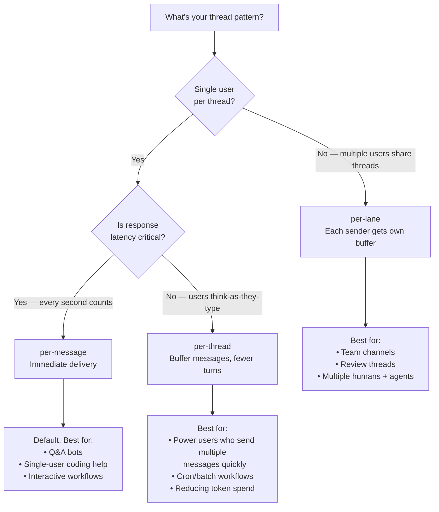

# Dispatch Mode Picker



## Configuration

```toml
[discord]
dispatch_mode = "per-message"       # default — immediate
# dispatch_mode = "per-thread"      # buffer per thread
# dispatch_mode = "per-lane"        # buffer per sender
dispatch_buffer_ms = 2000           # buffer window (per-thread and per-lane only)
```

## Trade-off Summary

| Mode | Latency | Token cost | Multi-user safe |
|------|---------|-----------|----------------|
| `per-message` | Lowest | Highest (many turns) | Yes (each message is own turn) |
| `per-thread` | + buffer_ms | Lower (batched turns) | No (messages from different users get combined) |
| `per-lane` | + buffer_ms | Lower (batched per sender) | Yes (each sender has own buffer) |

## Why `per-thread` Is Not Multi-User Safe

If UserA sends "implement feature X" and UserB sends "actually make it Y" within the buffer window, they get combined:

```
Agent sees: "implement feature X actually make it Y"
```

This is incoherent. Use `per-lane` whenever multiple humans might be in the same thread.

## Buffer Window Tuning

`dispatch_buffer_ms` is the quiet period — how long after the last message before the buffer flushes.

```
Too short (< 500ms): defeats the purpose, still sends partial thoughts
Good range: 1500-3000ms
Too long (> 5000ms): users perceive the bot as slow/unresponsive
```

`2000ms` (2 seconds) is a reasonable default for most teams.

## Does Mode Affect Cron Messages?

No. Cron messages always trigger their own ACP turn regardless of dispatch mode.
