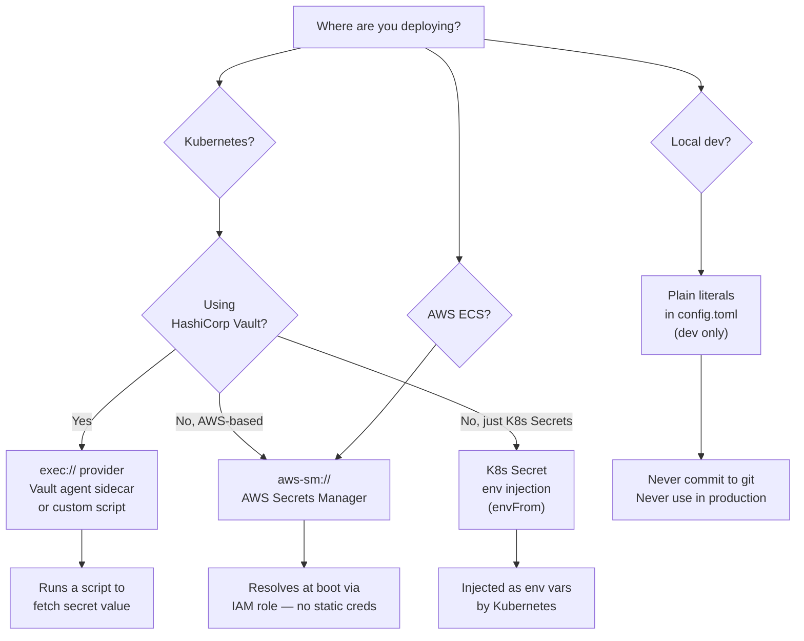

# Secrets Strategy



## Syntax Reference

### AWS Secrets Manager
```toml
[discord]
bot_token = "aws-sm://prod/openab/discord-bot#token"
#              └── secret name          └── JSON key
```

OpenAB fetches the secret at boot using the pod's IAM role. No static AWS credentials needed.

The secret in AWS Secrets Manager should be a JSON object:
```json
{"token": "your-actual-bot-token"}
```

### Exec Provider
```toml
[discord]
bot_token = "exec:///scripts/fetch-secret.sh discord_bot_token"
#              └── absolute path         └── args passed to script
```

The script receives the arguments and must print the secret value to stdout (nothing else).

### Kubernetes Secret (via env var injection)
```yaml
# values.yaml
envFrom:
  - secretRef:
      name: openab-secrets
```

```toml
# config.toml
[discord]
bot_token = "${DISCORD_BOT_TOKEN}"   # expanded from env at boot
```

### Plain Value (dev only)
```toml
[discord]
bot_token = "MTxxxxxxxxxxxxxxxxxxxxxxxxxxxxxxxxxxxxxxxxxxxxxxxxxxxxxxxxxxxxxxxxxx"
```

Never commit this to git. Use it only for local development with throwaway bot accounts.

## What Secrets OpenAB Needs

| Secret | What it's for | Typical provider |
|--------|--------------|-----------------|
| `discord.bot_token` | Discord WebSocket auth | AWS SM or K8s Secret |
| `slack.bot_token` | Slack API calls | AWS SM or K8s Secret |
| `slack.app_token` | Slack Socket Mode | AWS SM or K8s Secret |
| `agent.env.*` | Agent API keys (OpenAI, etc.) | AWS SM or K8s Secret |
| S3 access | pre_seed / pre_shutdown hooks | IAM role (no secret needed) |

## Failure Behavior

Missing or unresolvable secrets cause a **hard exit at boot**. OpenAB never starts in a degraded state with missing credentials. This is fail-closed by design.

```
ERROR openab::secrets — failed to resolve 'aws-sm://prod/openab/discord-bot#token': NoSuchSecretException
FATAL cannot start without all secrets resolved — exiting
```

Check CloudWatch logs or pod logs for the exact secret name that failed.
