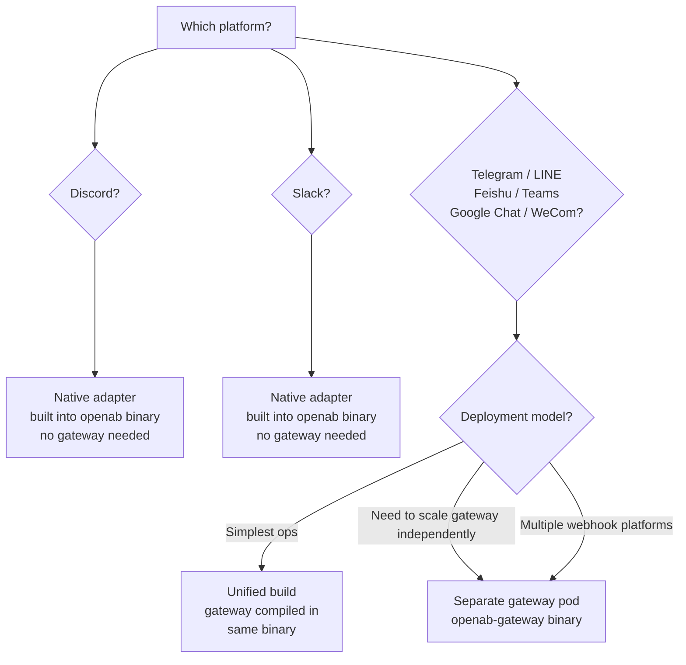

# Which Adapter? Native vs Gateway



## Why Two Tiers Exist

**Native adapters (Discord, Slack)** use persistent outbound WebSocket connections. OpenAB connects out to the platform — no inbound firewall rules needed, no TLS cert management for webhooks.

**Gateway-based adapters** work with webhook-based platforms. The platform sends HTTP POST events to your endpoint. The gateway receives them, normalizes them, and forwards to the main broker via an internal WebSocket.

## When to Use the Gateway

You need the gateway when running any of:
- Telegram
- LINE
- Feishu / Lark
- Google Chat
- WeCom
- Microsoft Teams

## Unified Build vs Separate Gateway Pod

**Unified build** (default for simple deployments):
```dockerfile
# Dockerfile.unified — all adapters compiled in
FROM rust:1-bookworm AS builder
RUN cargo build --features unified
```

One binary, one pod, handles everything. Simplest ops. Use this unless you have a reason not to.

**Separate gateway pod:**
```yaml
# Two deployments in Helm
agents:
  main:
    # openab binary — Discord/Slack native
gateway:
  enabled: true
  platforms: [telegram, line, feishu]
```

Use separate pods when:
- Gateway receives high webhook traffic (scale it independently)
- You want network isolation (gateway in DMZ, broker in private subnet)
- Gateway and broker need different resource profiles
- You're running Discord/Slack natively and adding a webhook platform later

## Platform Capability Differences

| Platform | Threads | Reactions | Slash cmds | Voice→Text | Edit msgs |
|----------|---------|-----------|-----------|-----------|----------|
| Discord | ✓ | ✓ | ✓ | ✓ | ✓ |
| Slack | ✓ | ✓ | — | — | ✓ |
| Telegram | simulated | — | — | ✓ | — |
| LINE | simulated | — | — | — | — |
| Feishu | ✓ | ✓ | — | — | ✓ |
| Teams | ✓ | limited | — | — | ✓ |

If you need slash commands or reaction-based status indicators, Discord is the richest platform.

## Adding a New Platform

Implement `ChatAdapter` in `crates/openab-gateway/src/`. The gateway pattern is the recommended extension point. See `crates/openab-gateway/src/telegram.rs` as a reference implementation.
