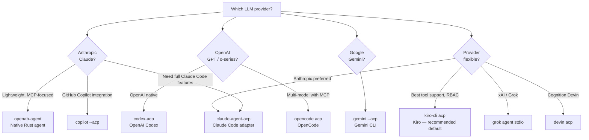

# Which Agent CLI?

OpenAB supports 15+ agent CLIs. Here's how to choose.

## Decision Tree



## Agent Quick Reference

| Agent | Command | Best for | Maturity |
|-------|---------|---------|---------|
| **Kiro** | `kiro-cli acp` | Full-featured default, RBAC agents, built-in MCP | Production |
| **Claude Code** | `claude-agent-acp` | Anthropic models, rich tool use | Production |
| **openab-agent** | `openab-agent` | Lightweight, skills, MCP client | Beta |
| **Codex** | `codex-acp` | OpenAI models, multi-model | Production |
| **Gemini** | `gemini --acp` | Google models | Production |
| **OpenCode** | `opencode acp` | OpenAI + MCP, open source | Production |
| **MiMo-Code** | `mimo acp` | Anthropic Claude, MiMo features | Production |
| **Copilot CLI** | `copilot --acp --stdio` | GitHub Copilot subscribers | Production |
| **Cursor** | `cursor-agent acp` | Cursor editor users | Beta |
| **Grok Build** | `grok agent stdio` | xAI models | Beta |
| **Devin** | `devin acp` | Autonomous software engineering | Production |
| **Hermes** | `hermes-acp` | NousResearch models | Beta |
| **Pi** | `pi-acp` | Pi agent | Beta |
| **Antigravity** | `agy-acp` | Local, via bundled adapter | Beta |

## The Default Recommendation: Kiro

Kiro is the reference ACP implementation and the most-tested agent with OpenAB. If you don't have a strong reason to use another agent, start with Kiro.

```toml
[agent]
command = "kiro-cli"
args = ["acp", "--trust-all-tools"]
```

## Running Multiple Agents

You can run different agents in different pods on the same channel:

```yaml
agents:
  kiro:
    command: kiro-cli
    args: [acp, --trust-all-tools]
  claude:
    command: claude-agent-acp
```

Each gets its own Discord bot identity and session pool. See [Deploy Multi-Agent](../03-use-cases/deploy-multi-agent.md).

## openab-agent (Native)

`openab-agent` is the native Rust agent built into this repo. It's:
- Lightweight (no Node.js runtime)
- Skills-based (`SKILL.md` files in `.openab/skills/*/`)
- MCP client support (under active development)
- Good for: embedding simple agents, custom skills, MCP bridging

Not a replacement for full-featured agents like Kiro or Claude Code for complex coding tasks.

## Further Reading

- `openab-agent/` — source for the native agent
- Docs: `docs/platforms/` — per-platform setup varies by agent
